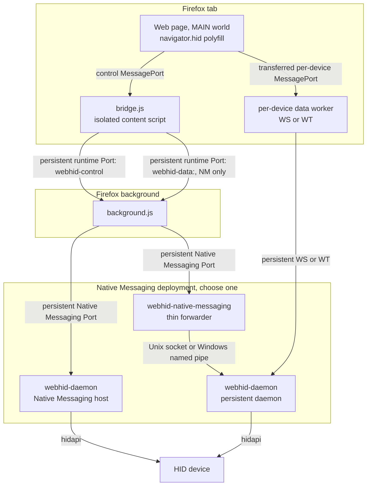
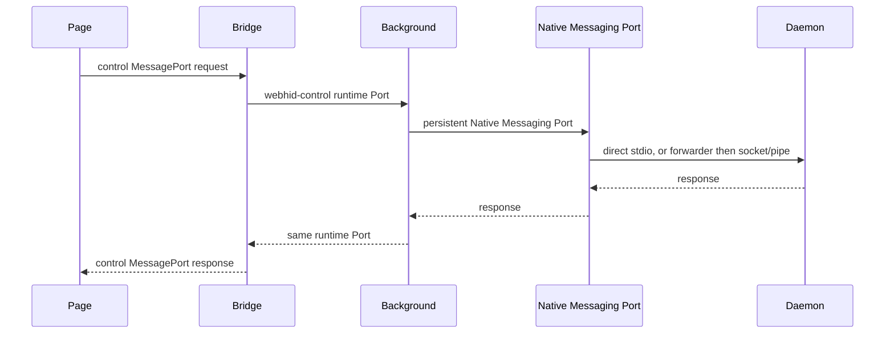
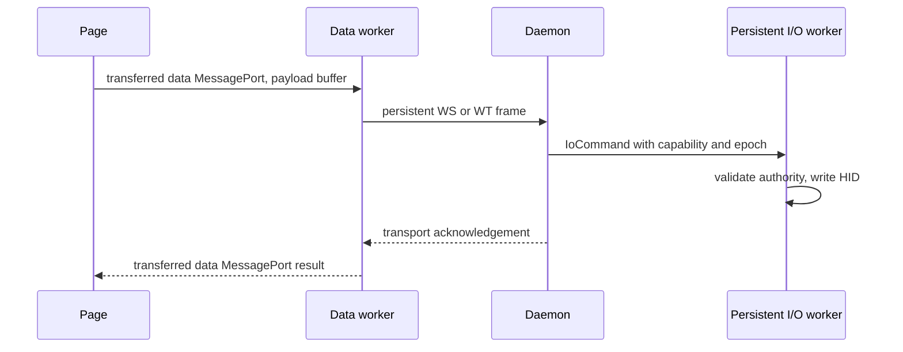
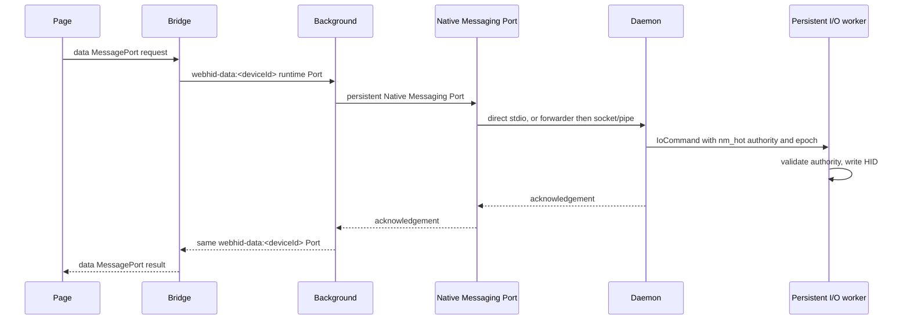
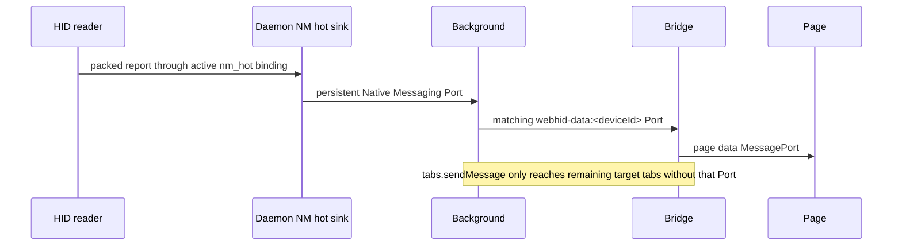
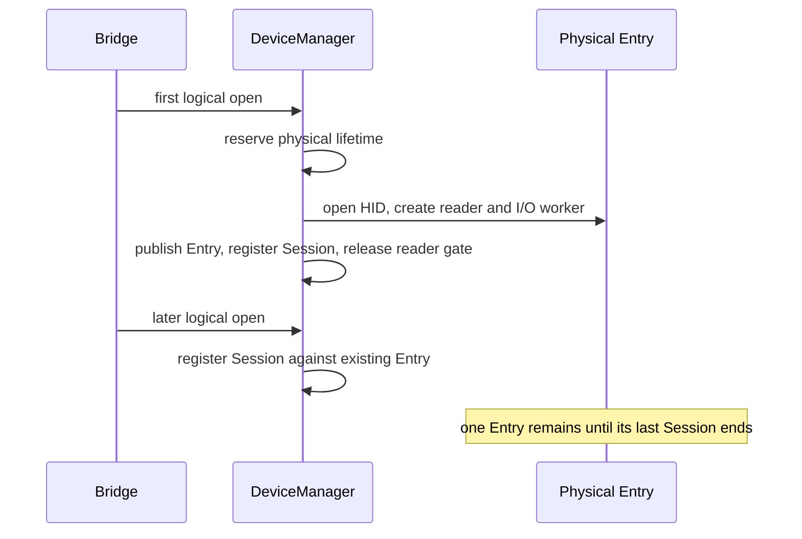

# Architecture

## Overview



The Native Messaging branches are deployment alternatives, not consecutive hops:

1. **Daemon as Native Messaging host:** `background → Native Messaging stdio → webhid-daemon`.
2. **Persistent daemon plus forwarder:** `background → Native Messaging stdio → webhid-native-messaging → Unix socket or Windows named pipe → webhid-daemon`.

`browser.runtime.connectNative()` establishes a persistent Native Messaging Port. Subsequent `postMessage()` calls reuse that Port and do not start another host process.

The `dataPlane` setting selects report transport: `wt` is the preferred default where available, `ws` is the alternate worker transport, and `nm` is the compatibility path. Control operations always use Native Messaging.

## Browser communication surfaces

### Persistent bridge Ports

The normal bridge to background path is Port-based:

- On load, `bridge.js` creates `browser.runtime.connect({name: 'webhid-control'})`. It queues ordinary bridge control requests and completes one pending request from each Port response.
- When an open device uses NM, the bridge creates or reuses `browser.runtime.connect({name: 'webhid-data:<deviceId>'})`. `sendReport`, `sendFeatureReport`, and `receiveFeatureReport` go through that per-device Port.
- Background receives both through `runtime.onConnect`, registers them with `registerContentPort`, and dispatches their requests through the same handlers as other callers. A response carries the request id back on the originating Port.

This replaces the old normal `bridge → runtime.sendMessage → background → sendResponse → bridge` model. `runtime.sendMessage` remains valid for one-shot cold or internal traffic, including extension-page interactions, picker operations, and MV2 resource fetches. It is not the normal bridge control or NM report path.

### Direct page to worker data path

For production WS and WT, `open()` creates a per-device `MessageChannel`. The page retains port1 and transfers port2 through the bridge during setup. The bridge transfers that port to the data worker. After setup, normal report traffic is:

```text
Page data MessagePort <-> data worker <-> persistent WS or WT <-> daemon
```

The bridge participates in worker spawn, port transfer, lifecycle, fallback, and data-plane control. It is not on the normal per-report page to worker hot path. If transferring the page port to the worker fails, the bridge uses its explicit fallback path instead.

## Components

| Component                                                  | Responsibility                                                                                                                                                                                                                                             |
| ---------------------------------------------------------- | ---------------------------------------------------------------------------------------------------------------------------------------------------------------------------------------------------------------------------------------------------------- |
| `content/main/index.js`                                    | MAIN-world WebHID polyfill. Uses the control MessagePort for general requests and a per-device data MessagePort for reports. Transfers report payload buffers where possible. Receives worker input batches directly and dispatches `HIDInputReportEvent`. |
| `content/isolated/bridge.js`                               | Owns persistent `webhid-control` and per-device `webhid-data:<deviceId>` runtime Ports, data-plane setup, worker lifecycle, settings propagation, consent enforcement, and NM fallback.                                                                    |
| `content/isolated/worker/index.js`                         | Per-device production WS or WT worker. Owns the persistent network transport and communicates directly with the page through the transferred data MessagePort.                                                                                             |
| `background/messages.js` and `background/content-ports.js` | Registers `runtime.onConnect` Ports with `registerContentPort`, routes their requests through the handler set, and replies on the same Port. Also retains the one-shot `runtime.onMessage` handler for legitimate extension and internal callers.          |
| `background/nm.js`                                         | Maintains one reconnecting `connectNative` Port, routes requests, decodes packed NM input, delivers first through matching `webhid-data:<deviceId>` Ports, then uses `tabs.sendMessage` only for target tabs not reached through those Ports.              |
| `webhid-native-messaging`                                  | Thin stdio to daemon socket/pipe forwarder. Used only in the persistent-daemon deployment.                                                                                                                                                                 |
| `webhid-daemon`                                            | Owns logical sessions and physical HID entries, Native Messaging client connections, WS/WT servers, reader, persistent per-device I/O worker, report blocking, and transport authority.                                                                    |

## Control plane

Control requests such as `enumerate`, `open`, `close`, `handshake`, `setDataPlane`, `getPolicy`, and paired-device operations travel:

```text
Page MessagePort → Bridge → persistent webhid-control runtime Port → Background
→ persistent Native Messaging Port → daemon or forwarder → daemon
```

The chooser and extension pages may use their own one-shot internal messaging where appropriate. Pairing remains bridge-side only after chooser selection. A page port cannot invoke the privileged pairing and cache-management actions.

## Production data planes

### WS and WT

The worker owns one persistent per-device transport. Output and feature operations use binary frames:

```text
[type:u8][reqId:u32 LE][reportId:u8][...payload]
```

Types are `0x01` for `sendReport`, `0x02` for `sendFeatureReport`, and `0x03` for `receiveFeatureReport`. The transport response types are `0x81`, `0x82`, and `0x83`. A device id is unnecessary because each WS or WT connection is bound to one device session.

Input reports are rate-gated into batches. A sparse report flushes immediately, sparse bursts coalesce briefly, and sustained high-rate traffic uses the configured high-rate window. The worker parses a batch and transfers its report buffers directly to the page data MessagePort. The bridge is bypassed after setup.

### Native Messaging

NM report operations use persistent interaction surfaces:

```text
Page data MessagePort
→ Bridge
→ persistent webhid-data:<deviceId> runtime Port
→ Background
→ persistent Native Messaging Port
→ daemon
→ persistent per-device IoCommand queue
→ persistent HID handle
```

`sendReport` and `sendFeatureReport` use packed binary TLVs encoded in the single JSON field `{"d":"<base64>"}`. `receiveFeatureReport` uses the NM JSON action. All three receive their acknowledgement or feature data on the same per-device runtime Port and then the bridge replies to the page data MessagePort.

The packed formats use little-endian integers:

| Message       | Direction       | Layout                                                                  |
| ------------- | --------------- | ----------------------------------------------------------------------- |
| input report  | daemon to addon | `[0x01][deviceId:u32]([reportId:u8][payloadLen:u16][payload])*`         |
| output report | addon to daemon | `[0x02][reqId:u32][deviceId:u32][reportId:u8][payloadLen:u16][payload]` |
| feature write | addon to daemon | `[0x04][reqId:u32][deviceId:u32][reportId:u8][payloadLen:u16][payload]` |

### NM input delivery

The primary NM input path is client-bound and Port-first:

```text
HID reader
→ active client-bound nm_hot sink
→ Native Messaging
→ Background
→ matching webhid-data:<deviceId> runtime Port
→ Bridge
→ Page data MessagePort
```

The reader sends a packed input report to each active, valid NM hot binding. The generic broadcast channel remains necessary for non-NM sessions and lifecycle events, but it is not the primary NM report delivery path. Background first calls `postToContentPorts` for target tabs and the matching data-Port name. It calls `tabs.sendMessage` only for target tabs that were not reached through a persistent data Port. That fallback remains needed for authorized targets without a registered Port.

## Daemon sessions and physical entries

A logical `Session` is not a physical device lifetime. `DeviceManager` shares one physical `Entry` per open device. An Entry contains the persistent HID handle, blocking reader, persistent I/O worker and queue, `io_epoch`, reader-start gate, report-blocking state, and teardown authority.

The first open performs a serialized physical-lifetime transition:

```text
OpenReservation → physical HID open → publish Entry → register Session → release reader-start gate
```

Concurrent or later opens find the published Entry and only register another logical Session. They do not necessarily call hidapi open again or create another reader or I/O worker.

Closing one Session invalidates that session's NM or transport authority and removes its auth mapping. The Entry is removed and its reader, I/O worker, and HID handle are stopped only when its last active Session ends, a device failure force-closes the lifetime, or equivalent lifetime teardown occurs.

### Authority model

Documentation intentionally describes the model rather than mirroring a Rust struct layout:

- A Session owns a device id, IPC client ownership, current mode, cancellation authority, and separate WS and WT generations.
- `ws_auth_hashes` maps **`ws_auth_hash → session_token`**. An auth hash dies with its logical Session.
- A WS or WT connection receives a generation-scoped `TransportGrant` containing a revocable `TransportCapability` and cancellation receiver.
- An active NM Session has a client-bound `nm_hot` binding that carries the output/feature queue authority and the input sink.
- Every queued output or feature command captures capability validity and the current `io_epoch`. The persistent I/O worker checks both before touching the HID handle.
- `OpenReservation`, lifecycle serialization, and the reader-start gate prevent a physical lifetime from being observed or revived during an invalidated open or teardown race.

Output, feature writes, and feature reads from NM, WS, and WT are all `IoCommand` values on the persistent per-device worker. There is no per-report blocking-task dispatch.

## Security and deployment notes

### WebSocket and WebTransport authentication

The daemon binds loopback transports only. The bridge derives `SHA-256(sessionToken || wsNonce)`. WS presents the hash in the `webhid.<hash>` subprotocol; WT presents it in the URL path. Both resolve through the `ws_auth_hash → session_token` mapping.

WT uses a pinned self-signed ECDSA certificate, a persistent bidirectional stream, and length-prefixed frames. Certificate renewal creates a new generation and lets existing connections drain.

### Local Network Access, observed Firefox 154 behavior

Firefox 154 applies Local Network Access enforcement to WebSocket and WebTransport connections created in a worker. Worker-context networking is not categorically exempt. A WebSocket worker attempt can surface the browser's LNA permission UI, while the WebTransport worker path retries without showing an LNA prompt until permission has been granted. In practice, granting LNA after a WS worker attempt can allow WT in the worker to work afterward. This is an observed Firefox 154 implementation detail, not a stable browser contract.

The bridge treats WS, WT, and worker-spawn failures as data-plane setup failures, not WebHID failures. It switches the session to NM when the selected network path cannot start. CSP, worker-spawn failure, LNA, and other network setup failures can all reach the automatic NM fallback.

For troubleshooting, `network.lna.blocking=false` is the narrower observed workaround; `network.lna.enabled=false` disables the broader mechanism. Firefox also exposes `network.lna.websocket.enabled`. There is no documented `network.lna.webtransport.enabled` preference to use here.

### HID access, consent, and socket protection

The daemon blocks FIDO devices at enumeration and applies report-level blocking to protected usages. Blocked input reports are dropped by the reader; blocked output and feature requests are rejected before they reach the I/O worker. The page cannot grant itself a device, enumerate the full inventory, or invoke picker-result and grant-management actions through its bridge Port. The bridge persists a chooser selection, and picker results are accepted only from the extension picker page.

For a root Linux daemon, the forwarder connects through the abstract `@webhid` socket and the daemon checks `SO_PEERCRED` against the `webhid` group. A user daemon instead uses a mode-`0600` runtime-directory socket. Daemon-as-NM-host mode has no forwarder socket because the daemon itself owns Native Messaging stdio.

### Device identity and reconnect

Device ids are FNV-1a 32-bit hashes of the platform device path. Linux uses the resolved sysfs path, Windows uses the device interface path, and macOS uses the IOService path. The value is carried as an unsigned JSON number and as a four-byte little-endian value in packed TLVs.

The background reconnects its Native Messaging Port with backoff. A forwarder separately retries its daemon socket or named-pipe connection. WS and WT workers reconnect their persistent transport after ready-state failures, while authentication failures ask bridge to attach a live Session token. A Native Messaging disconnect rejects pending requests, broadcasts `globalReset`, and closes the disconnected client's logical Sessions without affecting Sessions owned by another client.

### Worker spawning and worker polyfill

The production data worker is created in page context. `workerSpawnMode` selects shadow URL or blob spawning. Background pre-flights the page CSP; when a worker transport cannot be created because of CSP, spawn failure, LNA, or transport setup failure, bridge falls back to NM. On Chromium, blob spawning is the functional mode and the normal worker-spawn selector is hidden.

When `workerPolyfillEnabled` is enabled, background injects the worker polyfill into page-created workers. It exposes the specified WebHID surface but does not create a functional worker data plane. `requestDevice()` remains unavailable in that context.

### Valid one-shot runtime messages

The persistent bridge Ports do not replace every one-shot message. Current intentional `runtime.sendMessage` users are the isolated picker for enumeration and paired-device lookup, extension picker, device, and popup pages, and `utils/resource.js` for MV2 resource fetching. These are extension-page or cold/internal operations, not the normal bridge control or report paths.

### Settings

User-facing settings include `dataPlane`, `workerSpawnMode`, `daemonAsNmHost`, `hidePageAction`, `logLevel`, `devicePickerMode`, `workerPolyfillEnabled`, and `allowActivationlessRequestDevice`. `daemonAsNmHost` defaults to `true` on macOS and Windows and `false` elsewhere. `daemonAsNmHost` and `hidePageAction` are global-only; the other user-facing settings support site overrides.

`allowActivationlessRequestDevice` skips the user-activation check for `requestDevice()`. It is a spec deviation, but the chooser still requires explicit user selection and Permissions Policy still applies.

### Benchmark-only WT in-page mode

Production architecture covers only NM, worker WS, and worker WT. The code retains `dataPlane: 'wt'` with `useWorker: false` for benchmark and test runs. This in-page WT variant exposes daemon bearer credentials to the hostile MAIN world, so the normal settings UI hides it and normal user-facing documentation does not offer it as a data-plane option. `BENCHMARK.md` preserves its measured `wt-inpage` datasets and labels them benchmark-only.

## Message flows

### `getDevices()` through the control Port



### `sendReport()` through WS or WT



### `sendReport()` through NM



### NM input report



### First and additional open


