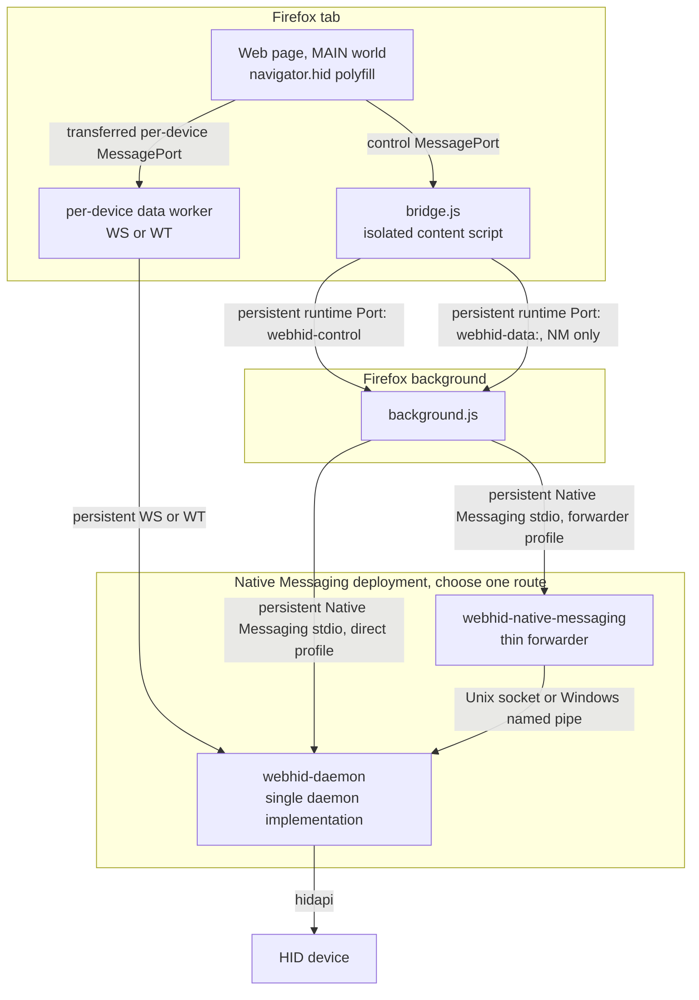
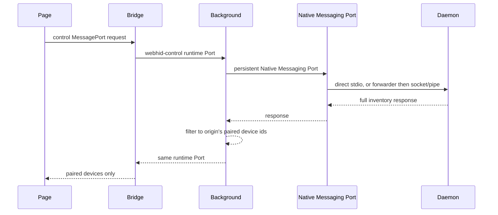
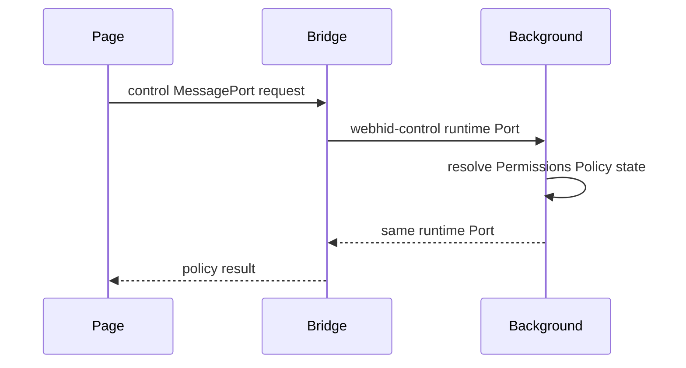
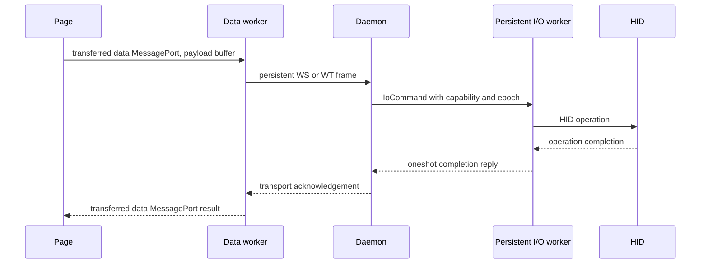
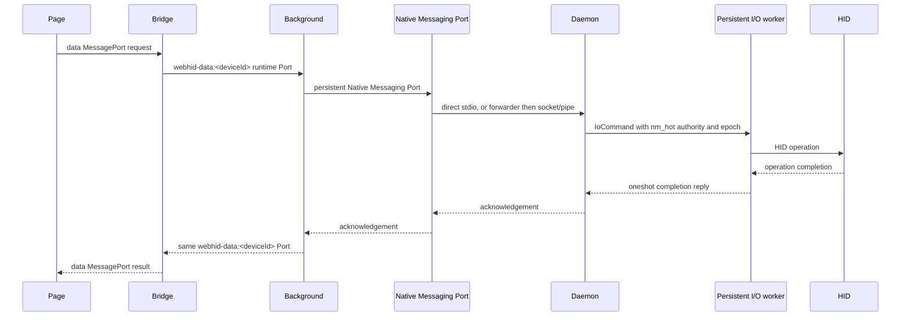
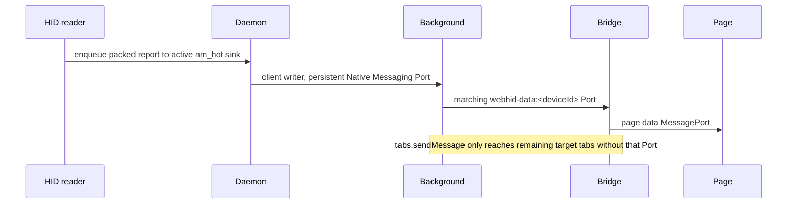
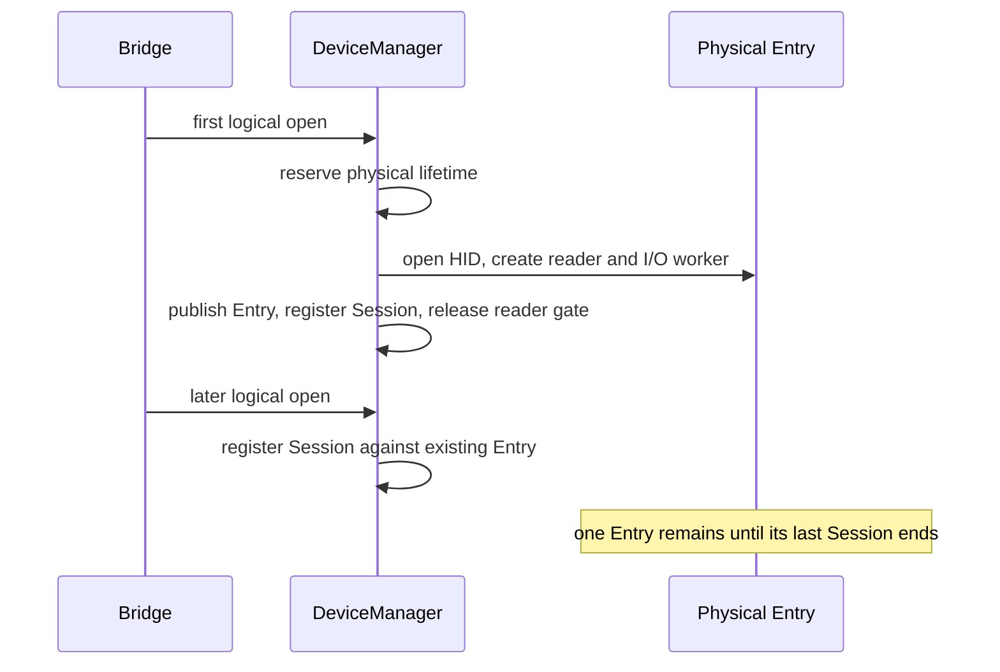

# Architecture

## Overview



The Native Messaging routes are deployment alternatives to the same daemon implementation:

1. **Daemon as Native Messaging host:** `background → persistent Native Messaging stdio → webhid-daemon`.
2. **Persistent daemon plus forwarder:** `background → persistent Native Messaging stdio → webhid-native-messaging → Unix socket or Windows named pipe → webhid-daemon`.

Worker WS and WT connections reach that same daemon in either profile, as does HID access. `browser.runtime.connectNative()` establishes a persistent Native Messaging Port. Subsequent `postMessage()` calls reuse that Port and do not start another host process.

The `dataPlane` setting selects report transport: `wt` is preferred when the handshake offers a WT endpoint, `ws` is the alternate worker network path, and `nm` is the compatibility path. A selected `wt` mode uses worker WT when available and uses worker WS when the handshake has no WT endpoint. Worker setup or transport failure can move the open session to NM. Normal page control requests use the persistent bridge control Port and then either terminate in addon state or continue over the persistent Native Messaging Port when the handler is daemon-backed. Extension-page control uses the one-shot internal paths described below.

## Browser communication surfaces

### Persistent bridge Ports

The normal bridge to background path is Port-based:

- On load, `bridge.js` creates `browser.runtime.connect({name: 'webhid-control'})`. It queues ordinary bridge control requests and completes one pending request from each Port response.
- When an open device uses NM, the bridge creates or reuses `browser.runtime.connect({name: 'webhid-data:<deviceId>'})`. `sendReport`, `sendFeatureReport`, and `receiveFeatureReport` go through that per-device Port.
- Background receives both through `runtime.onConnect`, registers them with `registerContentPort`, and dispatches their requests through the same handlers as other callers. A response carries the request id back on the originating Port.

This replaces the old normal `bridge → runtime.sendMessage → background → sendResponse → bridge` model. `runtime.sendMessage` remains valid for one-shot cold or internal traffic, including the isolated and extension picker flows, the devices and popup pages, the background's internal event notification, and extension resource fetching. It is not the normal bridge control or NM report path.

### Direct page to worker data path

For production WS and WT, `open()` creates a per-device `MessageChannel`. The page retains one data port and transfers the other to the data worker during setup. The bridge receives a separate worker control port so it can manage the worker. After setup, normal report traffic is:

```text
Page data MessagePort <-> data worker <-> persistent WS or WT <-> daemon
```

The bridge participates in worker spawn, port setup, lifecycle, fallback, and data-plane control. It is not on the normal per-report page-to-worker hot path. There is no implemented worker-to-bridge-to-page relay fallback. If worker setup or transport fails, the bridge uses NM for that device.

## Components

| Component                                                  | Responsibility                                                                                                                                                                                                                                             |
| ---------------------------------------------------------- | ---------------------------------------------------------------------------------------------------------------------------------------------------------------------------------------------------------------------------------------------------------- |
| `content/main/index.js`                                    | MAIN-world WebHID polyfill. Uses the control MessagePort for general requests and a per-device data MessagePort for reports. Transfers report payload buffers where possible. Receives worker input batches directly and dispatches `HIDInputReportEvent`. |
| `content/isolated/bridge.js`                               | Owns persistent `webhid-control` and per-device `webhid-data:<deviceId>` runtime Ports, data-plane setup, worker lifecycle, settings propagation, consent enforcement, and NM fallback.                                                                    |
| `content/isolated/worker/index.js`                         | Per-device production WS or WT worker. Owns the persistent network transport and communicates directly with the page through the transferred data MessagePort.                                                                                             |
| `background/messages.js` and `background/content-ports.js` | Registers `runtime.onConnect` Ports with `registerContentPort`, routes their requests through the handler set, and replies on the same Port. It also retains the one-shot `runtime.onMessage` handler for legitimate extension and internal callers.       |
| `background/nm.js`                                         | Maintains one reconnecting `connectNative` Port, routes daemon-backed requests, decodes packed NM input, delivers first through matching `webhid-data:<deviceId>` Ports, then uses `tabs.sendMessage` for targets not reached through those Ports.         |
| `webhid-native-messaging`                                  | Thin stdio to daemon socket or pipe forwarder. Used only in the persistent-daemon deployment.                                                                                                                                                              |
| `webhid-daemon`                                            | Single daemon implementation. Owns logical sessions and physical HID entries, Native Messaging client connections, WS/WT servers, reader, persistent per-device I/O worker, report blocking, and transport authority.                                      |

## Control plane

Normal page control requests use this browser-local route first:

```text
Page control MessagePort → Bridge → persistent webhid-control runtime Port → Background
```

The operation then terminates locally or continues over Native Messaging. The important classifications are:

| Operation                              | Classification                                  | Current behavior                                                                                                                                                            |
| -------------------------------------- | ----------------------------------------------- | --------------------------------------------------------------------------------------------------------------------------------------------------------------------------- |
| `getPolicy`                            | mixed addon-local                               | Bridge derives the requesting frame context and allow attribute, then background resolves stored Permissions Policy state. No daemon request.                               |
| `getPairedDevices`                     | background-local                                | Background reads the requesting origin's IndexedDB allowlist.                                                                                                               |
| `getDeviceInfo`                        | extension-page/background-local                 | Background returns live cache data or an IndexedDB record. Page ports are denied before this handler.                                                                       |
| `getDeviceCache`                       | mixed, extension-page only                      | Background returns its cache and persists it; only an empty cache triggers daemon enumeration to refresh it. Page ports are denied.                                         |
| `getAllowedDevices` / `getGrantGroups` | background-local                                | Reads origin grants or grant groups from IndexedDB.                                                                                                                         |
| `getAllPairedDevices`                  | extension-page/background-local                 | Groups IndexedDB grants by origin and enriches them from live cache or stored device info. Page ports are denied.                                                           |
| `pairDevice` / `recordGrantGroup`      | background-local                                | Updates IndexedDB after the bridge or chooser has completed user selection; page ports are denied.                                                                          |
| `forget` / `unpairDevice`              | mixed then background-local                     | Page `forget()` tears down its open session and data plane, then asks background to remove the origin grant; the action handler itself updates IndexedDB and notifies tabs. |
| `getBackendStatus`                     | daemon-backed plus background-local             | Handshakes with the Native Messaging endpoint and reports background connection state.                                                                                      |
| `getCspInfo`                           | background-local                                | Reads the frame's CSP analysis from extension session storage.                                                                                                              |
| `enumeratePaired`                      | daemon-backed plus background filtering         | The daemon inventory is fetched, then background filters it by the requesting origin's stored grants. Page `enumerate` is rewritten to this action.                         |
| chooser `enumerate`                    | daemon-backed                                   | Picker and extension-page callers retain the unmodified action and receive filtered or full chooser inventory according to their request.                                   |
| `requestDevice`                        | mixed UI plus local grant state                 | The bridge or extension picker obtains chooser inventory, the user selects devices, and the bridge records per-origin grants and any multi-device grant group.              |
| `open` / `close`                       | mixed local state plus daemon-backed            | Background checks tab and origin authority, performs the daemon operation, and updates its ownership maps. Bridge state creates or tears down the selected data plane.      |
| `revokeDevice`                         | mixed local state plus daemon close side effect | Background removes grants and groups, closes that origin's daemon sessions, and notifies affected tabs.                                                                     |
| `setDataPlane`                         | daemon-backed plus bridge transport state       | Background authorizes and forwards the session change; bridge respawns the selected worker or enables NM.                                                                   |
| `handshake`                            | daemon-backed                                   | Background asks the persistent Native Messaging endpoint for transport ports and capabilities.                                                                              |

Ordinary pages cannot request privileged grant-management or cache operations through their bridge Port, and cannot enumerate the full HID inventory. Chooser and extension pages are trusted internal callers for the operations listed above.

Settings handled directly by the bridge or extension pages do not use this route.

## Production data planes

### WS and WT

The worker owns one persistent per-device transport. Output and feature operations use binary frames:

```text
[type:u8][reqId:u32 LE][reportId:u8][...payload]
```

Types are `0x01` for `sendReport`, `0x02` for `sendFeatureReport`, and `0x03` for `receiveFeatureReport`. The transport response types are `0x81`, `0x82`, and `0x83`. A device id is unnecessary because each WS or WT connection is bound to one device session.

Input reports are rate-gated into batches. A sparse report flushes immediately, sparse bursts coalesce briefly, and sustained high-rate traffic uses the configured high-rate window. The worker parses a batch and transfers its report buffers directly to the page data MessagePort. The bridge is bypassed after setup.

### Native Messaging

NM report operations use persistent interaction surfaces:

```text
Page data MessagePort
→ Bridge
→ persistent webhid-data:<deviceId> runtime Port
→ Background
→ persistent Native Messaging Port
→ daemon
→ persistent per-device IoCommand queue
→ persistent HID handle
```

`sendReport` and `sendFeatureReport` use packed binary TLVs encoded in the single JSON field `{"d":"<base64>"}`. `receiveFeatureReport` uses the NM JSON action. All three receive their acknowledgement or feature data on the same per-device runtime Port and then the bridge replies to the page data MessagePort.

The packed formats use little-endian integers:

| Message       | Direction       | Layout                                                                  |
| ------------- | --------------- | ----------------------------------------------------------------------- |
| input report  | daemon to addon | `[0x01][deviceId:u32]([reportId:u8][payloadLen:u16][payload])*`         |
| output report | addon to daemon | `[0x02][reqId:u32][deviceId:u32][reportId:u8][payloadLen:u16][payload]` |
| feature write | addon to daemon | `[0x04][reqId:u32][deviceId:u32][reportId:u8][payloadLen:u16][payload]` |

### NM input delivery

The primary NM input path is client-bound and Port-first:

```text
HID reader
→ active client-bound nm_hot sink
→ Native Messaging
→ Background
→ matching webhid-data:<deviceId> runtime Port
→ Bridge
→ Page data MessagePort
```

The reader sends a packed input report to each active, valid NM hot binding. The generic broadcast channel is used for non-NM sessions and lifecycle events, not as the primary NM report path. Background first calls `postToContentPorts` for authorized target tabs and the matching data-Port name. It calls `tabs.sendMessage` only for target tabs not reached through a persistent data Port. After that one-shot delivery, bridge uses the page data port when present, otherwise its normal page event dispatch.

## Daemon sessions and physical entries

A logical `Session` is not a physical device lifetime. `DeviceManager` shares one physical `Entry` per open device. An Entry contains the persistent HID handle, blocking reader, persistent I/O worker and queue, `io_epoch`, reader-start gate, report-blocking state, and teardown authority.

The first open performs a serialized physical-lifetime transition:

```text
OpenReservation → physical HID open → publish Entry → register Session → release reader-start gate
```

Concurrent or later opens find the published Entry and only register another logical Session. They do not necessarily call hidapi open again or create another reader or I/O worker.

Closing one Session invalidates that session's NM or transport authority and removes its auth mapping. The Entry is removed and its reader, I/O worker, and HID handle are stopped only when its last active Session ends, a device failure force-closes the lifetime, or equivalent lifetime teardown occurs. The background's ownership cleanup is tab-scoped: tab removal purges sessions, but the current implementation has no frame navigation hook, so navigating an open frame does not itself close the daemon Session.

### Authority model

Documentation intentionally describes the model rather than mirroring a Rust struct layout:

- A Session owns a device id, IPC client ownership, current mode, cancellation authority, and separate WS and WT generations.
- `ws_auth_hashes` maps **`ws_auth_hash → session_token`**. An auth hash dies with its logical Session.
- A WS or WT connection receives a generation-scoped `TransportGrant` containing a revocable `TransportCapability` and cancellation receiver.
- An active NM Session has a client-bound `nm_hot` binding that carries the output/feature queue authority and the input sink.
- Every queued output or feature command captures capability validity and the current `io_epoch`. The persistent I/O worker checks both before touching the HID handle.
- `OpenReservation`, lifecycle serialization, and the reader-start gate prevent a physical lifetime from being observed or revived during an invalidated open or teardown race.

Output, feature writes, and feature reads from NM, WS, and WT are all `IoCommand` values on the persistent per-device worker. There is no per-report blocking-task dispatch.

## Security and deployment notes

### WebSocket and WebTransport authentication

The daemon binds loopback transports only. The bridge derives `SHA-256(sessionToken || wsNonce)`. WS presents the hash in the `webhid.<hash>` subprotocol; WT presents it in the URL path. The daemon resolves either value through the live `ws_auth_hash → session_token` mapping and then issues generation-scoped transport authority.

WT uses a pinned self-signed certificate with a `127.0.0.1` SAN, a persistent bidirectional stream, and length-prefixed frames. Certificate renewal creates a new generation and lets existing connections drain.

### Local Network Access, observed Firefox 154 behavior

Firefox 154 applies Local Network Access enforcement to WebSocket and WebTransport connections created in a worker. Worker-context networking is not categorically exempt. A WebSocket worker attempt can surface the browser's LNA permission UI, while the WebTransport worker path retries without showing an LNA prompt until permission has been granted. In practice, granting LNA after a WS worker attempt can allow WT in the worker to work afterward. This is an observed Firefox 154 implementation detail, not a stable browser contract.

The bridge's actual fallback is mode-dependent: WT uses WS when no WT endpoint is offered; a selected worker path that cannot spawn or connect moves the device to NM. A selected NM mode does not attempt a worker. CSP preflight can select NM before a shadow-worker attempt, while a selected blob worker can still fail at runtime and then move to NM. Transport authentication failure may trigger a data-plane refresh using an already-live Session token, not a new logical open.

For troubleshooting, `network.lna.blocking=false` is the narrower observed workaround; `network.lna.enabled=false` disables the broader mechanism. These are observed Firefox preferences, not a stable cross-version API contract. The automated harness forces `network.lna.enabled: false`, so its tests do not exercise the real permission flow.

### HID access, consent, and deployment-specific IPC protection

The daemon blocks FIDO devices at enumeration and applies report-level blocking to protected usages. Blocked input reports are dropped by the reader; blocked output and feature requests are rejected before they reach the I/O worker. The page cannot grant itself a device, enumerate the full inventory, or invoke picker-result and grant-management actions through its bridge Port. The bridge persists chooser selection, and picker results are accepted only from the extension picker page.

There are two Native Messaging deployment profiles. In daemon-as-NM-host mode, Firefox starts `webhid-daemon` directly and the daemon owns Native Messaging stdio; there is no daemon IPC socket. In the persistent-daemon profile, Firefox starts the thin forwarder, which connects to the daemon over platform IPC. On Linux, the daemon checks accepted Unix-socket clients against the `webhid` group, and the forwarder checks that the daemon peer is root or the same UID. A Linux root daemon commonly uses the abstract `@webhid` socket, while user sockets use mode `0600` runtime paths and other filesystem sockets use mode `0660`. macOS and Windows use their platform-specific socket or pipe behavior. These checks are not universal across profiles or platforms.

Native Messaging host authorization and the OS process boundary protect the direct profile; the persistent profile adds the platform IPC boundary. Session tokens are not required for pre-session handshake or open. Exact Session ownership is required for close and data-plane changes, and WS/WT use derived transport authentication backed by that Session. NM report I/O additionally requires the client-bound `nm_hot` binding.

### Device identity and reconnect

Device ids are FNV-1a 32-bit hashes of the platform device path. Linux uses the resolved sysfs path, Windows uses the device interface path, and macOS uses the IOService path. The value is carried as an unsigned JSON number and as a four-byte little-endian value in packed TLVs.

The background reconnects its Native Messaging Port with backoff. A forwarder separately retries its daemon socket or named-pipe connection. WS and WT workers reconnect their persistent transport after ready-state failures, while authentication failures ask bridge to attach a live Session token. A Native Messaging disconnect rejects pending requests, broadcasts `globalReset`, and closes the disconnected client's logical Sessions without affecting Sessions owned by another client.

### Worker spawning and worker polyfill

The production data worker is created in page context. `workerSpawnMode` selects shadow URL or blob spawning. Background pre-flights the page CSP. When a selected worker cannot be created or its transport cannot connect, bridge falls back to NM. On Chromium, blob spawning is the functional mode and the normal worker-spawn selector is hidden.

When `workerPolyfillEnabled` is enabled, background injects the worker polyfill into page-created workers. It exposes the specified WebHID surface but does not create a functional worker data plane. `requestDevice()` remains unavailable in that context.

### Valid one-shot runtime messages

The persistent bridge Ports do not replace every one-shot message. Current intentional `runtime.sendMessage` users are the isolated picker (`enumerate`, `getPairedDevices`), the extension picker (`getPendingPicker`, `enumerate`, and `pickerResult`), the devices page (grant listing and revocation), popup pages (frame origins, backend status, paired devices, revocation, device info, and cache), the background's internal device-event notification, and `utils/resource.js` for extension resource fetching. These are extension-page or cold/internal operations, not the normal bridge control or report paths.

### Valid one-shot tab messages

Current intentional `tabs.sendMessage` uses are global reset and device/lifecycle event fanout, grant-change and revocation notifications, picker-result delivery, popup requests to a tab bridge (`getFrameOrigins`, `getDataPlaneStatus`, `getOpenDeviceIds`), and NM input delivery for authorized tabs not reached through the matching persistent data Port. The one-shot tab input fallback can reach the bridge's page event path when no page data port is available.

### Settings

User-facing settings include `dataPlane`, `workerSpawnMode`, `daemonAsNmHost`, `hidePageAction`, `logLevel`, `devicePickerMode`, `workerPolyfillEnabled`, and `allowActivationlessRequestDevice`. `daemonAsNmHost` defaults to `true` on macOS and Windows when no stored value exists, and `false` elsewhere. `daemonAsNmHost` and `hidePageAction` are global-only; the other user-facing settings support site overrides.

`allowActivationlessRequestDevice` skips the user-activation check for `requestDevice()`. It is a spec deviation, but the chooser still requires explicit user selection and Permissions Policy still applies.

### Benchmark-only WT in-page mode

Production architecture covers only NM, worker WS, and worker WT. The code retains `dataPlane: 'wt'` with `useWorker: false` for benchmark and test runs. In this variant the page MAIN world receives the derived transport authentication value needed to establish WT, not the daemon Session bearer token. The variant measures the cost of moving transport handling, DataPipe reads, and parsing onto the page main thread. The UI hides it because it is benchmark-only, not because it is a security downgrade. `BENCHMARK.md` preserves its measured `wt-inpage` datasets and labels them benchmark-only.

## Message flows

### `navigator.hid.getDevices()` through the daemon-backed control path



The page-facing `navigator.hid.getDevices()` operation is rewritten to `enumeratePaired`. The daemon supplies the current inventory, while the background filters it against the requesting origin's stored grants. `requestDevice()` uses the chooser flow: its internal `enumerate` obtains full inventory data subject to chooser filters, then the bridge persists the selected devices as grants. Ordinary pages cannot enumerate the full HID inventory.

### `getPolicy()` through the browser-local control path



`getPairedDevices` follows the same control route and terminates in background addon storage. Settings handled directly by the bridge or extension pages do not require a background or daemon hop.

### `sendReport()` through WS or WT



### `sendReport()` through NM



### NM input report



For the tab fallback, `G` sends the one-shot tab message only to authorized targets not reached through the matching runtime Port. The bridge then uses a page data port when one is present, or its ordinary page event dispatch otherwise.

### First and additional open


