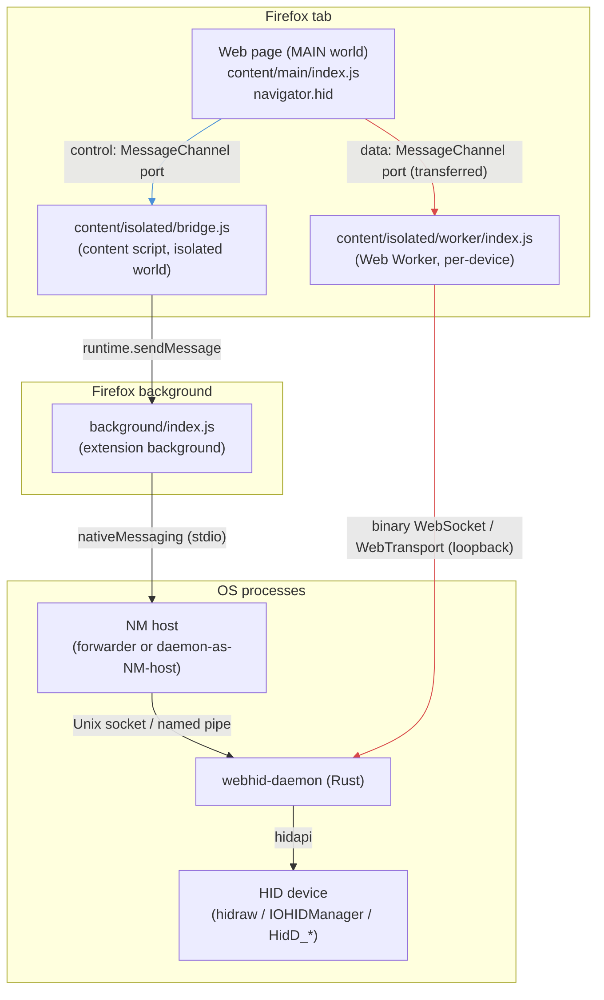
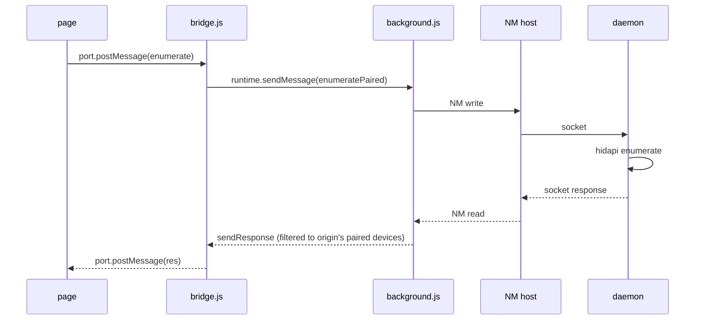
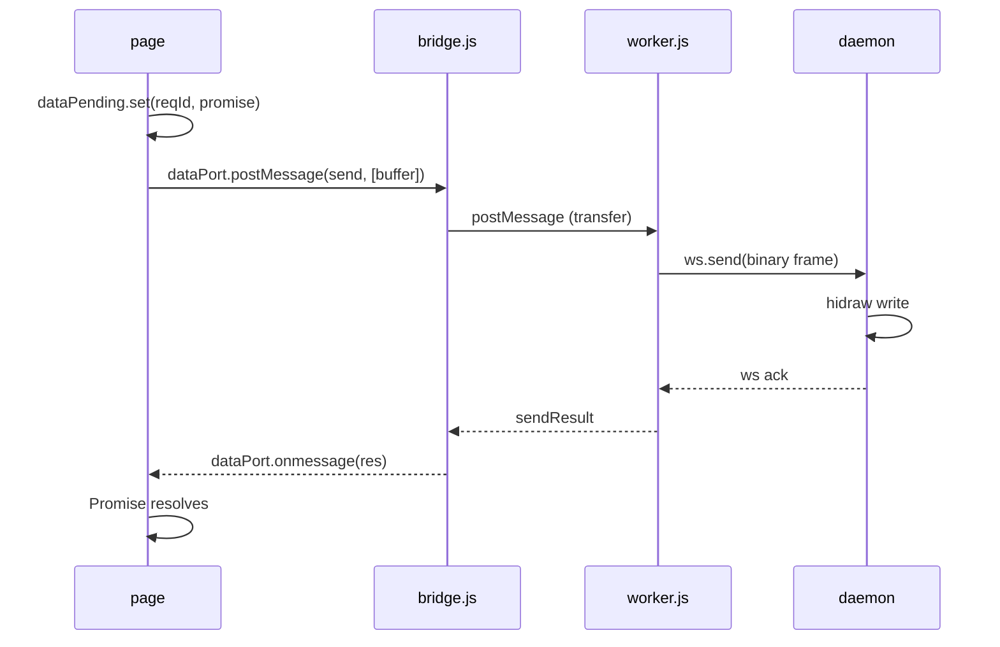
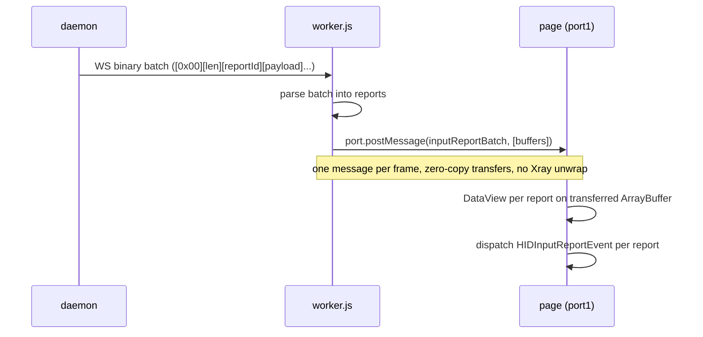
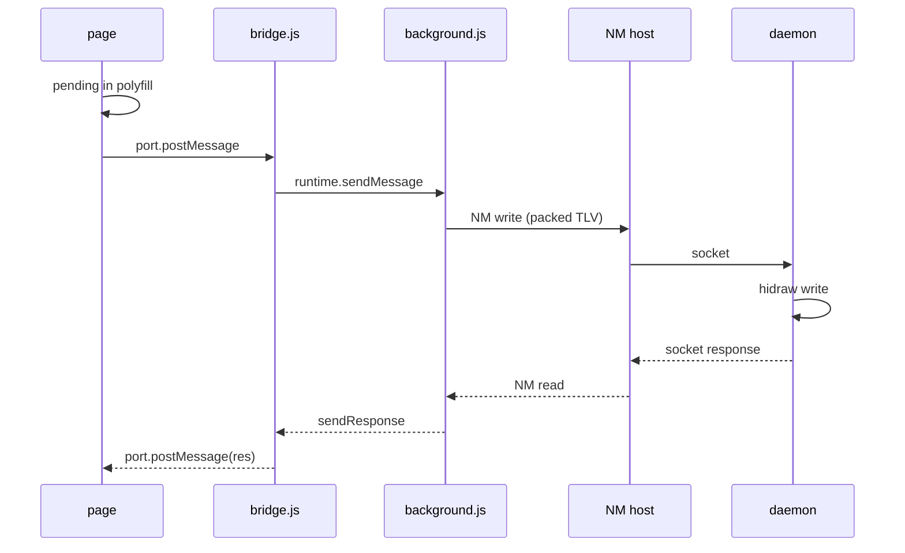
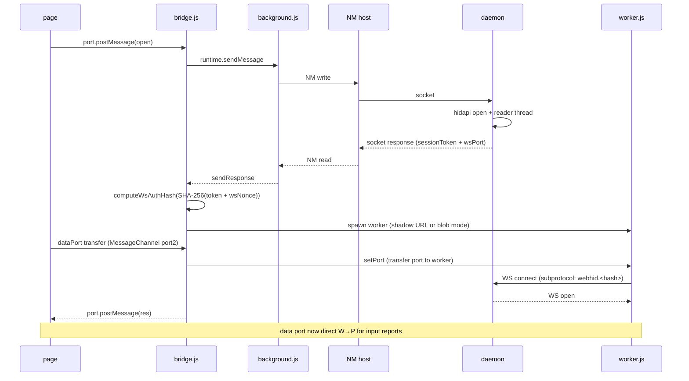
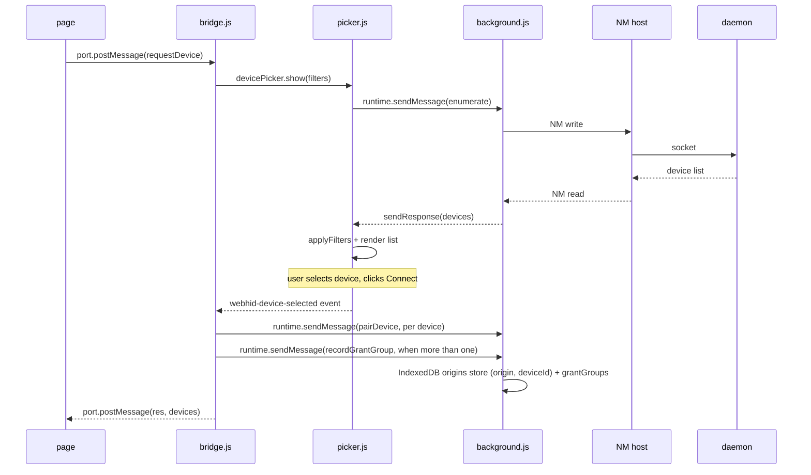
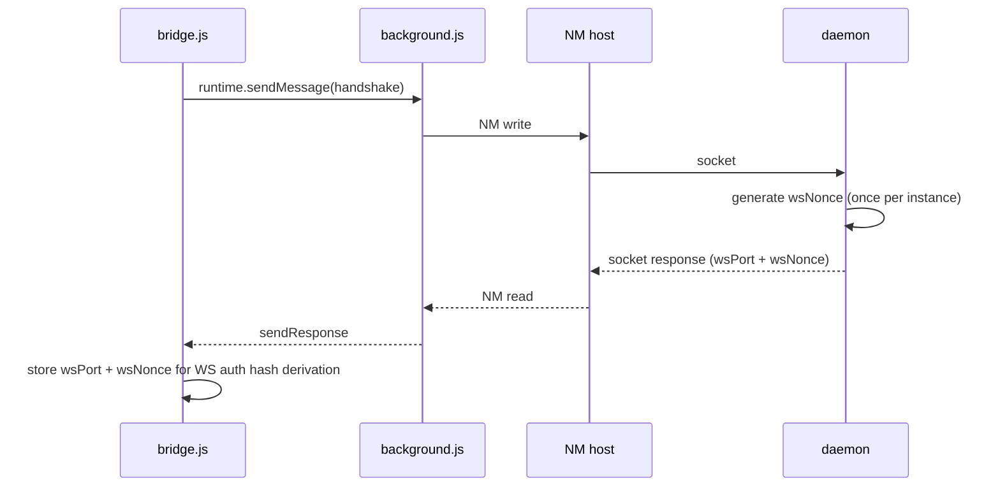
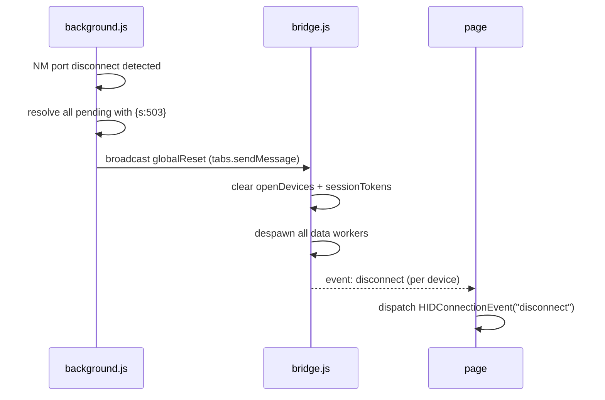

# Architecture

## Overview



The project has a single switchable plane:

- **Data Plane** (`sendReport`, input reports, feature reports): WT over QUIC via per-device data worker (default; DataPipe shared-memory reads, no main-thread delivery gate; self-signed cert pinned via `serverCertificateHashes`; falls back to WS on Firefox < 114), WS binary via per-device data worker, or NM. Controlled by the `dataPlane` setting (`wt`, `ws`, or `nm`).

Control operations (`enumerate`, `open`, `close`, `handshake`, `getPolicy`, `requestDevice`, `forget`) always go via NM.

## Components

| Component                          | What it does                                                                                                                                                                                                                                                                                                                                                                                                                                                                                                                                                                                                                                                                                                                                                                                                                                                                                                                                                                                                                                                                                 |
| ---------------------------------- | -------------------------------------------------------------------------------------------------------------------------------------------------------------------------------------------------------------------------------------------------------------------------------------------------------------------------------------------------------------------------------------------------------------------------------------------------------------------------------------------------------------------------------------------------------------------------------------------------------------------------------------------------------------------------------------------------------------------------------------------------------------------------------------------------------------------------------------------------------------------------------------------------------------------------------------------------------------------------------------------------------------------------------------------------------------------------------------------- |
| `content/main/index.js`            | Polyfills `navigator.hid` in MAIN world; guards on `isSecureContext`; communicates with bridge via a MessageChannel port (port1) using a per-frame `frameNonce` for request origin tracking; per-device data channel is a separate MessageChannel created on `open()` (port1 kept, port2 transferred to bridge then to worker); receives input reports via the data port (direct from worker, zero-copy); sendReport/sendFeatureReport resolve on ack from worker; zero-copy DataView on transferred ArrayBuffer for input reports; `requestDevice` checks `navigator.userActivation.isActive` unless called from devtools console (`isCalledFromConsole`); wraps `navigator.permissions.query` for `hid` descriptor via `getPolicy`; pre-claims pristine `MessagePort`/`MessageChannel`/`Worker.prototype.postMessage`/`window.postMessage` natives at document_start so page prototype patches cannot capture the bridge port; pairing is not done here (the bridge persists grants after chooser selection), `grantRequestedDevices` only maps granted devices to instances. Also runs inside page-created workers when `workerPolyfillEnabled` (see Worker polyfill injection below): in worker context it exposes the same constructors + `navigator.hid` on `self`, `requestDevice` throws `NotSupportedError`, `getDevices()` resolves with an empty list via the relayed bridge port (patched `Worker` constructor, see below) |
| `content/isolated/bridge.js`       | Content script (ISOLATED world); routes control/data actions; spawns per-device data worker in `shadow`, `blob`, or `nm` mode; caches `wtPort`/`wtCertHash` from the handshake; picks `createWsTransport` vs `createWtTransport` via the `dataPlane` setting (`ws`/`wt`) (see Worker spawn below); relays data MessagePort page↔worker; sends NM handshake on init to get wsPort + wsNonce; computes WS auth hash via `crypto.subtle.digest("SHA-256", token + wsNonce)`; in-memory `allowedDeviceIds` Set (synced via `getAllowedDevices` message + `allowedDevicesChanged` broadcast); `dataPort` auth check is sync (`Set.has`) not async; `SettingsStore` observer for live settings propagation; tracks open devices via `openDevices` Set; per-port origin tracking via `portOrigin` map (populated from browser-verified `MessageEvent.origin`); `getPolicy` checks iframe `allow="hid"` attribute for cross-origin frames; `globalReset` handler clears state on NM disconnect; consent gate: blocks privileged actions from page ports (`PAGE_BLOCKED_ACTIONS`: pairDevice, recordGrantGroup, getGrantGroups, getAllPairedDevices, revokeDevice, getDeviceCache, getDeviceInfo, showPicker, pickerResult), rewrites page `enumerate` to `enumeratePaired`, and persists grants bridge-side after chooser selection (`grantSelectedDevices`) |
| `content/isolated/worker/index.js` | Web Worker (per-device, WS or WT data plane); binary frames to daemon via `createWsTransport` (WS) or `createWtTransport` (WT, persistent QUIC stream); input reports forwarded via transferred MessagePort (direct to page, zero-copy, no Xray); sendReport/sendFeatureReport sent as binary WS frames, resolved on WS ack (`handleControlResponse`); receiveFeatureReport via WS; auto-reconnect with exponential backoff; detects WS auth-failure close code 4401/4402 and triggers token refresh via bridge                                                                                                                                                                                                                                                                                                                                                                                                                                                                                                                                                                              |
| `content/main/index.js` (worker context) | Worker polyfill (dual-context): when `workerPolyfillEnabled` is true (global or per-site), background serves the same polyfill bundle into page-created Web Worker scripts (see Worker polyfill injection below), where it exposes HID, HIDDevice, HIDInputReportEvent, HIDConnectionEvent + `navigator.hid` on the worker scope. `requestDevice` throws `NotSupportedError`; `getDevices()` resolves with an empty list via the bridge port relayed into the worker. |
| `background/index.js`              | Extension background entry (`background.scripts` event page). Wires `runtime.onMessage` routing to the handlers in `messages.js`, initializes NM/storage/settings/webRequest/CSP modules, broadcasts `globalReset` to all tabs on NM disconnect. The per-action handlers (enumerate, enumeratePaired, open/close, pairDevice (bridge-internal only), send/feature reports, pickerResult with sender validation) live in `messages.js`; NM connect/send/parse in `nm.js`; Permissions-Policy parsing + worker-bundle/CSP interception in `webrequest.js`; packed TLV builders in `packed.js`                                                                                                                                                                                                         |
| `background/state.js`              | Shared mutable state: `deviceCache`, `deviceTabMap`, `permissionsPolicy`, `allowedCrossOrigin`, `pendingPicker`, `workerPolyfillSites`                                                                                                                                                                                                                                                                                                                                                                                                                                                                                                                                                                                                                                                                                                                                                                                                                                                                                                                                                       |
| `background/storage.js`            | IndexedDB `webhid-store`: `deviceInfo` store (keyPath: `deviceId`) + `origins` store (compound key `[origin, deviceId]`); `getAllowedDevices`/`addAllowedDevice`/`removeAllowedDevice` use per-record atomic ops (no read-modify-write)                                                                                                                                                                                                                                                                                                                                                                                                                                                                                                                                                                                                                                                                                                                                                                                                                                                      |
| `background/nm.js`                 | `NativeMessaging` singleton: connect/reconnect/sendRequest/sendPacked; packed TLV event decode; `onPackedData`/`onControlEvent` handlers                                                                                                                                                                                                                                                                                                                                                                                                                                                                                                                                                                                                                                                                                                                                                                                                                                                                                                                                                     |
| `background/bundle.js`             | `ensureWorkerBundle` + `ensureWorkerPolyfillBundle`: fetch + concatenate JS files into a single string for StreamFilter injection                                                                                                                                                                                                                                                                                                                                                                                                                                                                                                                                                                                                                                                                                                                                                                                                                                                                                                                                                            |
| `background/packed.js`             | NM constants (ACT, EVT, PKG) + `buildPackedSend` binary TLV builder                                                                                                                                                                                                                                                                                                                                                                                                                                                                                                                                                                                                                                                                                                                                                                                                                                                                                                                                                                                                                          |
| `background/state_ops.js`          | Tab tracking: `registerDeviceTab`/`unregisterDeviceTab`/`isTabAuthorizedForDevice`/`purgeTab`; `broadcastGlobalReset`                                                                                                                                                                                                                                                                                                                                                                                                                                                                                                                                                                                                                                                                                                                                                                                                                                                                                                                                                                        |
| `background/messages.js`           | `runtime.onMessage` HANDLERS map: enumerate (full, chooser + extension pages), enumeratePaired (origin-filtered for page ports), open/close/sendReport/sendFeatureReport/receiveFeatureReport (tab-authorized), getPairedDevices/getAllowedDevices, pairDevice (bridge-internal only, never page-reachable), unpairDevice (forget), revokeDevice (grant-group cascade), pickerResult (sender.url validated against the picker page), getPolicy, getDeviceInfo (page callers gated on paired/tab authorization)                                                                                                                                                    |
| `background/webrequest.js`        | Permissions-Policy header parsing into the `permissionsPolicy` map (`onHeadersReceived`, main_frame/sub_frame); CSP pre-flight + meta/header rewriting for blob workers; worker bundle + worker-polyfill injection via `filterResponseData`; `storeFrameCspInfo` per tab/frame                                                                                                                                                                                                                                                                              |
| `background/csp.js`               | CSP helpers used by webrequest: `parseCspForWorkerSpawn`, `rewriteCspValue`, `rewriteCspForBlob`, `urlOrigin`, `frameKey`                                                                                                                                                                                                                                                                                                                                                                                                            |
| `content/isolated/picker/index.js` | `WebHidDevicePicker` class (ISOLATED world); closed-mode Shadow DOM (`attachShadow({mode:'closed'})`); three modes via `devicePickerMode` setting: `modal` (default, inline dialog), `pageAction` (url-bar popup), `window` (separate popup window)                                                                                                                                                                                                                                                                                                                                                                      |
| `internal/pages/settings/`         | Settings UI (colocated HTML+CSS+JS): data plane (WS/NM), worker spawn mode (shadow/blob), log level, daemon-as-NM-host, device picker mode, worker polyfill toggle                                                                                                                                                                                                                                                                                                                                                                                                                                                                                                                                                                                                                                                                                                                                                                                                                                                                                                                           |
| `internal/pages/popup/`            | Popup UI (colocated HTML+CSS+JS): per-site device list + settings overrides                                                                                                                                                                                                                                                                                                                                                                                                                                                                                                                                                                                                                                                                                                                                                                                                                                                                                                                                                                                                                  |
| `content/isolated/inject.js`       | MV2-only MAIN-world injector. Fetches scripts via `runtime.sendMessage` `fetchResource`, injects as one `<script>`. Referenced only in `manifest.v2.json`. Not used in MV3 (content scripts use `"world": "MAIN"`).                                                                                                                                                                                                                                                                                                                                                                                                                                                                                                                                                                                                                                                                                                                                                                                                                                                                          |
| `utils/base64.js`                  | Polyfills `Uint8Array.fromBase64` + `Uint8Array.prototype.toBase64` if absent. Used by background for NM packed TLV base64.                                                                                                                                                                                                                                                                                                                                                                                                                                                                                                                                                                                                                                                                                                                                                                                                                                                                                                                                                                  |
| `utils/bootstrap.js`               | Module registry: `globalThis.webhid` with `export(name, value)` / `import(name)` backed by a Map. Polyfills `globalThis` if absent.                                                                                                                                                                                                                                                                                                                                                                                                                                                                                                                                                                                                                                                                                                                                                                                                                                                                                                                                                          |
| `utils/websocket.js`               | `createWsTransport` factory: WS connect/reconnect/backoff/auth-failure-handling. Reconnect 500ms→5s exponential backoff. Close codes 4401/4402 → `onAuthFailed` (halts reconnect). Subprotocol `webhid.<hash>` where hash is `SHA-256(sessionToken + wsNonce)`.                                                                                                                                                                                                                                                                                                                                                                                                                                                                                                                                                                                                                                                                                                                                                                                                                              |
| `utils/webtransport.js`            | `createWtTransport` factory: WT connect over `serverCertificateHashes`-pinned QUIC; one persistent bidirectional stream, every frame length-prefixed, one `onBinary` per frame; auth-failure detection via ready rejection or early close; no auto-reconnect (v1)                                                                                                                                                                                                                                                                                                                                                                                                                                                                                                                                                                                                                                                                                                                                                                                                                            |
| `utils/descriptor-tlv.js`          | `decodeCollectionsTlv(base64)`: decodes TLV binary + base64 wire format for `DeviceInfo.collections` into JS `HIDCollectionInfo[]` objects. Called once at cache time in background.                                                                                                                                                                                                                                                                                                                                                                                                                                                                                                                                                                                                                                                                                                                                                                                                                                                                                                         |
| `utils/i18n.js`                    | `t(key, subs)` wrapper around `browser.i18n.getMessage` + `localizeHTML(root)` for `data-i18n` attribute scanning. Works on document + shadow DOM.                                                                                                                                                                                                                                                                                                                                                                                                                                                                                                                                                                                                                                                                                                                                                                                                                                                                                                                                           |
| `webhid.forwarder_nm_host`         | Thin byte-pipe NM host (forwarder mode): stdin ↔ Unix socket/named pipe via vectored I/O (`write_vectored`) on all platforms                                                                                                                                                                                                                                                                                                                                                                                                                                                                                                                                                                                                                                                                                                                                                                                                                                                                                                                                                                 |
| `webhid.daemon_nm_host`            | Daemon-as-NM-host mode: daemon speaks NM directly on stdin/stdout (auto-detected via Firefox's 2 positional args)                                                                                                                                                                                                                                                                                                                                                                                                                                                                                                                                                                                                                                                                                                                                                                                                                                                                                                                                                                            |
| `webhid-daemon`                    | Long-running service; hidapi device handles; WS server (data only, loopback-only, port 0 by default); rate-gated batching (25µs adaptive, 8ms high-rate); Arc<[u8]> broadcast; per-session `dataplane_modes` (HashMap<session_token, mode>); `has_nm_session` check for NM event forwarding; udev hot-plug; FIDO/U2F per-product blocklist (`hid.rs`) + collection/report-level blocklist (`blocklist.rs`: mouse/keyboard/keypad/System Control/Jabra/OnlyKey); report-level blocking via `is_report_blocked` on send/feature paths; abstract socket `@webhid` (Linux root); SO_PEERCRED + webhid group check; seccomp BPF + prctl hardening (Linux, release-only); constant-time WS auth hash comparison via `subtle::ConstantTimeEq`                                                                                                                                                                                                                                                                                                                                                       |
| `crates/webhid`                    | Shared Rust library: message types (NmRequest, NmResponse, IpcRequest, IpcResponse), protocol framing, base64 serde, FNV-1a device ID hash, `collections_tlv` module (TLV binary + base64 serde for `DeviceInfo.collections`). NM wire uses single-char field names + HTTP status codes; packed binary TLVs for hot-path messages + collections.                                                                                                                                                                                                                                                                                                                                                                                                                                                                                                                                                                                                                                                                                                                                             |

## Control plane (NM only)

All control operations use length-prefixed JSON over NM stdio (Firefox ↔ NM host) and Unix socket/named pipe (NM host ↔ daemon):

- `enumerate` (page ports get `enumeratePaired`, filtered to the origin's paired devices; the chooser and extension pages call `enumerate` directly), `open`, `close`, `handshake`, `setDataPlane`, `requestDevice` (chooser), `forget`/`unpairDevice`, `getPolicy`, `getPairedDevices`
- Pairing (`pairDevice`, `recordGrantGroup`) runs bridge-side only, after the user selects in the chooser; a page port can never send it
- `open()` returns sessionToken + wsPort (and the daemon's wsNonce is obtained via handshake)
- `handshake` returns wsPort + wsNonce (one-time, on bridge init)

## Data plane

### WT mode (default, worker + MessagePort)

High-frequency operations via binary WebSocket frames in a per-device Web Worker:

**sendReport (page → daemon):** polyfill posts to its data MessagePort (port1) with transfer; worker receives, builds a binary WS frame, sends it. Worker awaits WS ack (`handleControlResponse`), then posts `sendResult` back to the data port; polyfill resolves the Promise on receipt. Wire format:

```
[type:u8][reqId:u32 LE][reportId:u8][...payload]
```

Types: `0x01` sendReport, `0x02` sendFeatureReport, `0x03` receiveFeatureReport. Responses: `0x81` sendReport ack, `0x82` sendFeatureReport ack, `0x83` receiveFeatureReport response. 6-byte header (no device ID; the WS connection is per-device).

**Input reports (daemon → page):** rate-gated batching. A single report flushes immediately (0µs added latency); sparse bursts coalesce with a 25µs window; once ~12+ reports are flushed within a 4ms window (8kHz polling), the coalesce window widens to 8ms so per-frame overhead is amortized without adding latency at low rates. The worker parses the batch and forwards the whole frame to the page in one `dataPort.postMessage({type:'inputReportBatch', reports}, transfers)` (per-message port overhead at 8000 msg/s dropped reports under main-thread load: the worker parsed everything, the page missed 0.2-0.4% mid-run). Wire format, one type-prefixed frame per WS message (the worker also accepts legacy frames without the type byte):

```
[type:0x00][len:u16 LE][reportId:u8][...payload][len:u16 LE][reportId:u8][...payload]...
```

**MessagePort direct delivery:** on `open()`, polyfill creates a `MessageChannel`, keeps port1 as `dataPort`, and transfers port2 to bridge via the control port. Bridge transfers port2 to the worker (`setPort` message). The worker posts one `inputReportBatch` message per frame with every report's ArrayBuffer transferred; it arrives directly at page's port1 `onmessage`, where the polyfill dispatches one `HIDInputReportEvent` per report. This bypasses the bridge entirely for input reports, eliminating Xray unwrap allocations and reducing context hops. If the port transfer fails, bridge falls back to forwarding via `onDataPortMessage` (NM path).

**Zero-copy polyfill:** Polyfill creates `DataView` directly on the transferred `ArrayBuffer`, with no intermediate `new Uint8Array` copy. This eliminates ~70% of per-event allocations and prevents GCMajor from triggering during benchmarks.

### NM mode (optional)

All data routes via NM: `sendReport` → bridge → background → NM host → daemon. NM wire is JSON + base64 (Firefox spec requires UTF-8 JSON, binary framing is not allowed). Hot-path messages use packed binary TLVs encoded as base64 inside a single JSON field `{"d":"<b64>"}` to minimize wire overhead.

**Packed TLV formats** (all multi-byte integers little-endian):

| msgType | Direction      | Layout                                                               | Used for                          |
| ------- | -------------- | -------------------------------------------------------------------- | --------------------------------- |
| 0x01    | daemon → addon | `[0x01][devId u32]([reportId u8][payloadLen u16][payload])*`         | input_report (multi-report batch) |
| 0x02    | addon → daemon | `[0x02][reqId u32][devId u32][reportId u8][payloadLen u16][payload]` | sendReport                        |
| 0x04    | addon → daemon | `[0x04][reqId u32][devId u32][reportId u8][payloadLen u16][payload]` | sendFeatureReport                 |

The NM sendReport/sendFeatureReport TLV includes a device ID (12-byte header) because the NM connection is shared across all devices, unlike the per-device WS connection. `receiveFeatureReport` uses JSON (not packed) with action code 5.

For packed messages, `reqId` lives inside the TLV (not the JSON `n` field), so the JSON wrapper is just `{"d":"<b64>"}` with no `a`/`n`/`i`/`r` fields. Non-packed messages (enumerate, open, close, receiveFeatureReport, setDataPlane, handshake) use JSON with numeric action codes (`"a":1..8`) and single-char field names.

**Responses** use HTTP status codes in the `s` field (200/201/204/4xx/5xx) instead of separate `ok`/`err` fields. Error responses contain only `{"n":N,"s":<code>}`: no error message string on the wire (the daemon logs it).

**bg→tab IPC:** background.js decodes the base64 TLV and sends the payload as a `Uint8Array` to the tab via `tabs.sendMessage` (structured clone, not zero-copy: `tabs.sendMessage` has no transfer list). Polyfill receives `Uint8Array` directly, no re-decode needed.

sendReport/sendFeatureReport via NM resolve on the NM ack. Input reports come via NM events → `tabs.sendMessage` → bridge → page (or directly via the data port if a worker is present).

## Daemon optimizations

| Optimization                                    | Effect                                                                                                                                                  |
| ----------------------------------------------- | ------------------------------------------------------------------------------------------------------------------------------------------------------- |
| `Arc<[u8]>` for broadcast data                  | Zero-clone broadcast (refcount bump, not memcpy)                                                                                                        |
| `Arc::from(&frame[6..])` in WS binary handler   | Zero-copy slice for spawn_blocking                                                                                                                      |
| Batch Vec stores `(u8, Arc<[u8]>)`              | No per-report `full_report` alloc; reportId prepended in `create_batch_frame`                                                                           |
| Rate-gated flush (25µs adaptive, 8ms high-rate) | 0 latency for sparse, ≤25µs for bursts, 8ms coalescing above ~12 reports/4ms (kills render-load report loss at 8kHz)                                    |
| Per-session `dataplane_modes`                   | Events sent only to sessions with matching mode; `has_nm_session` checks if any session on a device is in NM mode before forwarding InputReports via NM |
| Thread-local `WRITE_BUF` / `READ_BUF`           | Avoids per-call allocation in hot path                                                                                                                  |
| NM packed TLVs (0x01/0x02/0x04)                 | Hot-path messages use `{"d":"<b64>"}` wrapper, reqId inside TLV: saves 7-14 bytes vs JSON fields                                                        |
| NM bg→tab Uint8Array transfer                   | Background decodes base64 once, sends Uint8Array to tab (structured clone): saves 1 encode + 1 decode per input report                                  |
| WS close code 4401/4402                         | Auth-failure close codes let workers distinguish stale token from network error, trigger token refresh instead of blind retry                           |
| Abstract socket `@webhid` (Linux root)          | No filesystem entry, no symlink attack surface                                                                                                          |
| SO_PEERCRED + webhid group check                | Verifies connecting process is in the `webhid` group (Linux, non-abstract sockets)                                                                      |

## Security

### HID blocklist

Two independent mechanisms:

1. **Per-product blocklist** (`hid.rs` `BLOCKED_DEVICES`): FIDO/U2F security keys (YubiKey, Feitian, OnlyKey, Nitrokey, Google Titan, HID Global, U2F Zero, Mooltipass, VASCO, Keydo, Thetis, JaCarta, Happlink, Bluink) blocked by (vendorId, productId) tuple. Also blocks any device with `usage_page == 0xF1D0` (FIDO usage page). Matches Chromium's `hid_blocklist.cc`.

2. **Rule blocklist** (`blocklist.rs`): rule-based blocking. Device-level rules match vendor/product only (OnlyKey `0x1d50/0x60fc`); usage-based rules (Generic Desktop Mouse `0x0001/0x0002`, Keyboard `0x0001/0x0006`, Keypad `0x0001/0x0007`, System Control `0x0001/0x0080`, FIDO `0xF1D0`, Jabra `0x0b0e`/`0xff00` reportId `0x05` output) are enforced per report: input reports are dropped at the reader, output/feature writes are rejected at send. This matches the WICG spec (`blocklist.txt`) and Chromium: consumer-input devices stay enumerable, only their reports are blocked. The Generic Desktop consumer-input rules (mouse/keyboard/keypad/system control) are enforced unconditionally, matching Chromium's always-on blocklist (no cargo-feature gate); mouse/keyboard/keypad access is additionally gated by the OS layer (udev on Linux, HID API on Windows, Input Monitoring/TCC on macOS), not by the daemon alone.

### Consent model

A page cannot grant itself a device, see the full inventory, or spoof the chooser:

- **Pairing is bridge-side only.** The bridge blocks privileged actions from page ports (`PAGE_BLOCKED_ACTIONS`) and persists the grant itself (`grantSelectedDevices`) after the user picks in the chooser (modal, pageAction, or window mode). `pairDevice` is never reachable from a page port.
- **Page-facing enumerate is paired-only.** A page's `enumerate` is rewritten to `enumeratePaired`, and the background filters the response to the requesting origin's paired device hashes. The chooser and extension pages call `enumerate` directly and still see everything.
- **The chooser result is sender-validated.** `pickerResult` is rejected unless `sender.url` is the extension's picker page; `getDeviceInfo` from a page caller is gated on the device being paired for the origin (or tab-authorized).
- **The page cannot intercept the bridge channel.** The polyfill (MAIN world) shares the page's JS realm, so it pre-claims pristine `MessagePort`/`MessageChannel`/`Worker.prototype.postMessage`/`window.postMessage` natives at document_start; page prototype patches cannot capture the bridge port.
- Regression coverage: `tests/e2e/picker-bypass.spec.ts` attempts the prototype-patch capture and asserts the chooser flow still grants.

### WebSocket security

- Daemon binds WS server to `127.0.0.1` only; rejects non-localhost `Host`/`Origin` headers (403)
- Every WS connection is authenticated via a per-device auth hash: `SHA-256(sessionToken || wsNonce)` presented as WS subprotocol `webhid.<hash>`
- No separate control token; the daemon has no text-frame or control-connection path

### WebTransport data plane

- WT server binds `127.0.0.1:0` at daemon startup (like the WS server); the certificate is a self-signed ECDSA P-256 cert with SAN `127.0.0.1` and a validity of at most 14 days, generated once at boot (or on renewal). The bridge pins it via `serverCertificateHashes` (SHA-256 of the DER), which is why the handshake returns `wt_port` (`W`) + `wt_cert_hash` (`H`) alongside the WS info.
- Auth reuses the WS scheme: the same `SHA-256(sessionToken || wsNonce)` hash is placed in the WT URL path (`https://127.0.0.1:<port>/<hash>`), and the daemon resolves it against the same `ws_auth_hashes` map (WebTransport has no subprotocol).
- One persistent bidirectional stream per session: every frame (batch flush or control response) is written with an explicit `[len_u32 LE]` prefix so message boundaries are unambiguous on the continuous stream (the batch format itself is not self-delimiting: a report id of 0 is legal). The JS transport buffers and reassembles, delivering one `onBinary` per frame; the same framing carries page-to-daemon messages on the other half of the stream. Benchmark results are in docs/BENCHMARK.md.
- Renewal (only reachable when a daemon runs past 14 days): on `handshake`, `ensure_current` checks the current generation's expiry; expired certs trigger a new generation on a new UDP port with a fresh cert. The old generation keeps serving existing connections (drain) and rejects new ones (`404`), then releases its port once active sessions reach zero. Pages holding a stale port fall back to NM via the bridge's ready-timeout path.
- **In-page variant** (`useWorker` off): WT is the only transport that can run without the data worker. The bridge sends a `dataPlaneConnect` message over the page's control port and the polyfill creates the `createWtTransport` connection on the main thread. The full hot path runs in-page: input batches are parsed by `pushInPageBatch`, and `sendReport`/`sendFeatureReport`/`receiveFeatureReport` build the same binary frames as the worker and write them over the same stream, resolving on the daemon ack (`handleInPageControlResponse`). The bridge data-port (NM) path remains only as the fallback while the plane is not open. This is the `loss-wt-inpage` benchmark mode; it trades main-thread CPU (the contention the worker exists to avoid) for the simpler lifecycle, and is only offered for WT (`useWorker` is hidden in the UI for `ws`/`nm`).
- The daemon-side mode guard (`has_nm_session` / `MODE_WT`) prevents NM double-delivery while a WT session is active, mirroring the WS mode lifecycle.
- CPU cost on loopback is higher than WS/NM (TLS/QUIC encryption); this is the cost being measured in the benchmark, not a gain (see AGENTS.md).

### Token authentication

- **Device session token**: generated per `open()`, 128-bit hex. The bridge computes `SHA-256(sessionToken + wsNonce)` and the worker presents it as the WS subprotocol.
- **wsNonce**: generated once per daemon instance (128-bit hex), returned in the `handshake` NM response. Combined with the session token to produce the WS auth hash so the raw token never leaves the NM channel.

### IPC socket permissions (Linux)

- **Root daemon** (systemd system service): abstract socket `@webhid` (no filesystem entry). SO_PEERCRED is checked on every accepted Unix stream: the connecting process's GID must match the `webhid` group, with a fallback to `/proc/<pid>/status` supplementary groups. Users must be in the `webhid` group to connect via the thin forwarder:

```sh
sudo usermod -aG webhid $USER
# log out + log back in for group change to take effect
```

- **User daemon**: filesystem socket under `$XDG_RUNTIME_DIR/webhid/webhid.sock` or `/run/user/<uid>/webhid/webhid.sock` with mode `0o600`. No peer-cred check needed (abstract-socket-only check; user socket is protected by directory permissions).

Alternatively, users with direct hidraw access (via udev `uaccess` rule) can skip the forwarder entirely by enabling **Daemon as NM host** in addon settings: the daemon speaks NM directly on stdin/stdout, no socket needed.

## Device IDs

Stable, platform-independent hashes (FNV-1a 32-bit):

```
deviceId = fnv1a_32(path_bytes)
```

- **Linux**: the `path` is the resolved syspath (canonicalized `/sys/class/hidraw/<name>/device` parent directory), not the raw `/dev/hidrawN` path.
- **Windows**: device interface path. **macOS**: IOService path.

Same physical device in same USB port produces the same hash across reboots. Two devices with identical vid/pid/serial but different physical ports have different paths → different hashes.

The hash is sent as a JSON number in wire fields and as a 4-byte little-endian u32 in packed binary TLVs. On the JS side, the unsigned right shift `>>> 0` is mandatory when decoding to avoid signed int32 wraparound for hashes ≥ 0x80000000.

## Reconnect

All layers auto-reconnect with exponential backoff:

- **NM host → daemon:** retry socket connect (100ms → 2s cap, 5s total timeout). On timeout, writes `{"s":503,"E":"..."}` error frame to stdout before exiting so the addon logs the reason.
- **background.js → NM host:** retry `connectNative` (1s → 10s). On disconnect, resolves all pending with `{s:503}` and broadcasts `globalReset` to all tabs.
- **Data worker → daemon WS:** retry WebSocket (500ms → 5s). On auth-failure close code (4401 unknown token / 4402 bad token), halts auto-reconnect and asks bridge for a fresh token via `auth-failed` message; bridge re-opens the device and respawns the worker.
- **Daemon:** detects NM disconnect, closes devices; page receives `disconnect` event, re-opens on `connect` event.

## Settings

Settings are stored in `browser.storage.local` with per-key format: global settings use key `settings :: <name>`, site overrides use `settings :: <origin> :: <name>` (separator `" :: "` with spaces to avoid collision with IPv6 origin literals). The `SettingsStore` factory + key helpers (`globalSettingKey`, `siteSettingKey`, `parseSettingsKey`, `loadGlobalSettings`, `loadSiteSettings`, `saveGlobalSetting`, `saveSiteSetting`) live in `js/utils/settings.js`. A schema version key `meta :: storage :: version` prevents re-migration.

Device info cache and origin device allowlists are stored in IndexedDB (`webhid-store`), not `storage.local`. Object stores: `deviceInfo` (keyPath: `deviceId`) and `origins` (compound key `[origin, deviceId]`). Content scripts maintain an in-memory `allowedDeviceIds` Set synced via `getAllowedDevices` message + `allowedDevicesChanged` broadcast from background.

| Setting                            | Values                            | Default                       | Description                                                                                                                                                                                                                                                                    |
| ---------------------------------- | --------------------------------- | ----------------------------- | ------------------------------------------------------------------------------------------------------------------------------------------------------------------------------------------------------------------------------------------------------------------------------ |
| `dataPlane`                        | `ws` / `wt` / `nm`                | `wt` (`ws` on Firefox < 114)  | Data plane: WT worker (QUIC, pinned self-signed cert, default), WS worker, or NM via bridge                                                                                                                                                                                    |
| `workerSpawnMode`                  | `shadow` / `blob`                 | `shadow` (MV3) / `blob` (MV2) | Data worker spawn strategy (see Worker spawn below). `shadow` = `new Worker(location.href)` served by webRequest interception; `blob` = blob URL from the worker bundle, requires page CSP rewrite. Falls back to the other mode, then to NM, based on CSP pre-flight.         |
| `useWorker`                        | bool                              | `true`                        | WT only: run the data plane in a dedicated worker (default) or in-page on the main thread. WS always uses the worker; NM never does. The UI only shows this option when `dataPlane` is `wt`.                                                                                   |
| `daemonAsNmHost`                   | bool                              | `false` (`true` on Windows)   | Use daemon-as-NM-host (skip forwarder + socket)                                                                                                                                                                                                                                |
| `logLevel`                         | 0 to 3                            | `1`                           | 0=error, 1=warn, 2=info, 3=debug                                                                                                                                                                                                                                               |
| `devicePickerMode`                 | `modal` / `pageAction` / `window` | `modal`                       | Device picker UI mode                                                                                                                                                                                                                                                          |
| `workerPolyfillEnabled`            | bool                              | `false`                       | Inject WebHID polyfill into page-created Web Workers                                                                                                                                                                                                                           |
| `allowActivationlessRequestDevice` | bool                              | `false`                       | Skip the user-activation check in `requestDevice()` (spec deviation). Workaround for sites that call `requestDevice()` without a live user gesture (e.g. async after a fetch). The device chooser still requires explicit user selection; Permissions Policy check unaffected. |

Each consumer (background, bridge, polyfill, worker) creates its own `SettingsStore` instance: a Proxy-backed observer that fires listeners only when a value actually changes. Reads are direct property access (`settings.dataPlane`); writes are either assignment (`settings.logLevel = 2`) or bulk (`settings.set({...})`). Subscriptions via `settings.on('key', cb)` or `settings.on(['k1','k2'], cb)`.

The bridge's `storage.onChanged` listener extracts `changes[k].newValue` from Firefox storage events and calls `settings.set(patch)`: the store handles the diffing internally. The daemon-as-NM-host setting defaults to `true` on Windows (auto-detected in `loadNmHostSetting`).

`daemonAsNmHost` is the only global-only setting: `loadSiteSettings` (and the `SITE_SETTING_NAMES` list it iterates) excludes it, so a site override can never shadow the global NM-host choice. Every other setting (`dataPlane`, `workerSpawnMode`, `useWorker`, `logLevel`, `devicePickerMode`, `workerPolyfillEnabled`, `allowActivationlessRequestDevice`) is per-site overridable from the popup. Changes propagate live through the `storage.onChanged` → `settings.set` path: the bridge re-routes open devices when `dataPlane` or `useWorker` changes, resets the spawn-mode cache when `workerSpawnMode` changes, re-levels its logger when `logLevel` changes, and `devicePickerMode` is re-read at the next `requestDevice()` call. `workerPolyfillEnabled` is the exception: it applies at worker-creation time, so per-site toggles need a page reload (the background refreshes `workerPolyfillSites` immediately).

## Worker spawn (shadow URL / blob / NM)

Firefox MV3 content scripts cannot spawn Web Workers from extension URLs in page context, and pages may have CSPs that block worker sources. The data worker is spawned in page context using one of two modes, chosen per site by the `workerSpawnMode` setting (shadow is the MV3 default, blob the MV2 default):

- **Shadow URL** (default on MV3): `new Worker(location.href)`. Background's `webRequest.onBeforeRequest` detects the synthetic self-request (`details.url === details.documentUrl` modulo fragment) and serves the worker bundle (bootstrap + logger + settings + websocket + worker) via `filterResponseData`; `onHeadersReceived` rewrites the `Content-Type` to `application/javascript` and strips CSP/length headers. Touches nothing about the page except one synthetic request. Fails if the server rejects that request or under `require-trusted-types-for 'script'` with a restrictive allow-list.
- **Blob + CSP rewrite** (default on MV2): the bridge fetches the worker bundle (`getWorkerBundle`), creates `URL.createObjectURL(new Blob([text]))`, and spawns from the blob URL through a `trustedTypes` policy (`webhid-worker`). Background rewrites `<meta http-equiv="content-security-policy">` and (MV2 only) header CSP to add `blob:` to `worker-src` and `ws://127.0.0.1:*` to `connect-src`, plus the `trusted-types` allow-list entry when `require-trusted-types-for` is active.

**CSP pre-flight**: background parses the page's header + meta CSP at navigation time (`parseCspForWorkerSpawn`) and stores the verdict in `storage.session` under `csp:<tabId>:<frameId>` (`workerSrc`, `connectSrc`, `shadowBlocked`, `needsBlobFallback`, `headerShadowBlocked`, ...). The bridge queries it via the `getCspInfo` message and picks the mode:

1. setting says `blob` → blob
2. shadow blocked but blob viable → blob (`needsBlobFallback`)
3. MV3 + header CSP blocks shadow and blob rewrite is impossible (MV3 is strengthen-only, header CSP cannot be relaxed) → **NM** (`workerSpawnMode` effectively `nm`; the worker is never spawned and the data plane uses NM)
4. otherwise → shadow

If the shadow spawn itself throws at runtime (e.g. the server rejected the self-request), the bridge retries once with blob, then falls back to NM.

`useWorker: false` (WT only) skips worker spawn entirely: the bridge sends `dataPlaneConnect` over the page port and the polyfill hosts the WT connection in-page (see the WT data plane section). The popup hides `workerSpawnMode` whenever `useWorker` is off or the data plane is `nm`.

## Worker polyfill injection (opt-in)

When `workerPolyfillEnabled` is true (globally or per-site), background.js prefixes the worker-polyfill bundle (bootstrap + logger + http + settings + device + content/main/index.js) into page-created worker scripts via `webRequest.filterResponseData`. The bundle is injected after any leading `"use strict"` directive so the polyfill's `globalThis.webhid` registry is available before the page's worker script runs.

Inside the worker, `content/main/index.js` detects the worker context (`isWorker`) and exposes `HID`, `HIDDevice`, `HIDInputReportEvent`, `HIDConnectionEvent` on `self` plus `navigator.hid` on the worker navigator. `requestDevice()` throws `NotSupportedError` (spec: `[Exposed=Window]` only), `new HID()`/`new HIDDevice()` throw `TypeError` (illegal constructor). `getDevices()` resolves with an empty list: the polyfill patches the page's `Worker` constructor to relay a bridge MessagePort into each worker it spawns, so the worker's requests reach the background (and return no paired devices for a worker origin).

This gives spec-compliance coverage of the worker exposure surface (constructors exist, SameObject holds, requestDevice correctly refuses) without a functional worker data plane.

## Message flow examples

### `navigator.hid.getDevices()`



### `sendReport()` WS (ack-wait)



### Input report via MessagePort (WS data plane)



### `sendReport()` NM (ack-wait)



### `open()` (NM control + WS data plane setup)



### `requestDevice()` (picker UI + pairing)



### `handshake()` (NM, one-time on bridge init)



### NM disconnect → global reset


