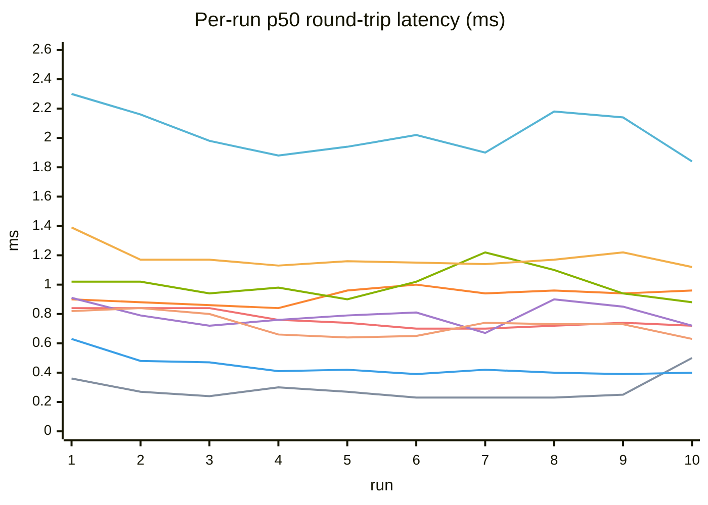
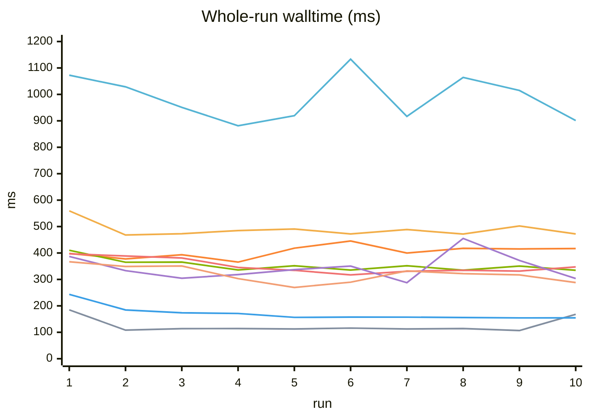
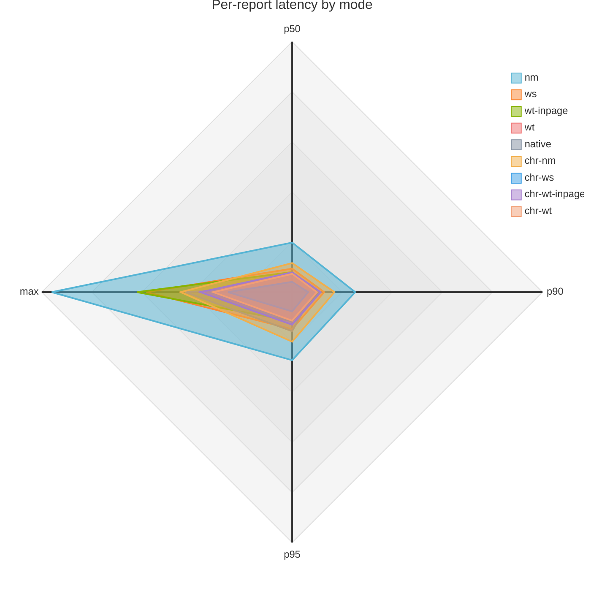
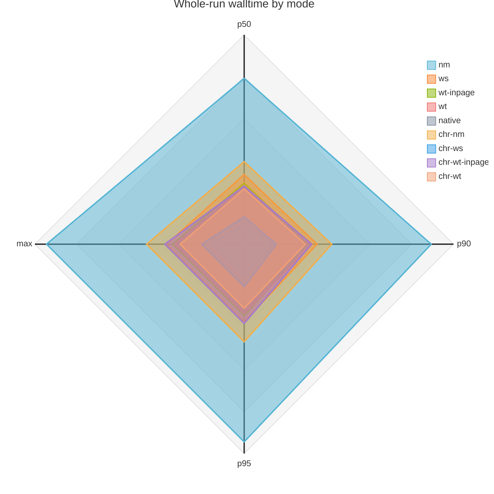

# FF-WebHID Benchmark Report

## Automated image-pipeline benchmark

A Playwright-driven end-to-end benchmark measuring the full data-plane round-trip automatically. The Firefox project (`firefox-benchmark`) exercises the three production modes, nm, ws, and worker wt, plus `wt-inpage`, a benchmark-only WT configuration. `wt-inpage` sets `dataPlane: 'wt'` with `useWorker: false`, so the hostile MAIN world owns the transport and can see daemon bearer credentials. The settings UI hides it, and it is not a supported user-facing data plane. The Chromium projects run native WebHID (`chromium-benchmark`) and the addon on the same Chromium build (`chromium-addon-benchmark`) across the same benchmark modes.

**Scenario**: a benchmark page fetches a small PNG fixture
(`tests/fixtures/images/sample.png`, the project icon, ~32KB), chunks it into
62-byte
payloads behind a 2-byte sequence header (64-byte `sendReport(1, chunk)` per
chunk, the vendor report size), and sends every chunk with ack-wait. A
**streaming relay** injects every output report the `uhid-mock` echoes
straight back through the mock's `input` command, so input reports flow to
the page while it is still sending instead of arriving in one burst at the
end. The image decode
(`createImageBitmap`) runs inside the measured window, and incoming chunks
trigger **batched row-slice repaints** (a few
pixel rows per paint, so the image fills in progressively), keeping rendering
a real part of
the measured window instead of a single ~6ms final decode. That makes CPU
contention between the data plane and page rendering (the ws-vs-nm gap)
visible in the numbers: if WS receive/parse on a dedicated
worker really stays off the main thread, the render-heavy load should not
slow ws as much as nm. The measured window is
`performance.measure('roundtrip', 'send-start', 'image-painted')`,
10 runs per mode, printed with open (device open call duration),
warm-up (total wall time from warm-up start until a retry succeeds, so
failed attempts are included) and total (device open through run #1's
send-start) durations. Then a per-run table where each run's ~520 reports
are summarized as min/p50/p90/p95/max of per-report round-trip latency
(send to the report arriving back) plus the run's walltime (whole-run
roundtrip), followed by a min/p50/p90/p95/max summary of the whole-run
round-trip durations.

**What the numbers mean**: the round-trip includes an artificial relay hop
(mock stdout → test script → mock stdin), because a real HID device does not
echo output reports as input reports. The relay adds a roughly constant term
to every run, so it does not skew the ws-vs-nm comparison, but the absolute
values are not comparable to hardware latency. The measured window also
includes the page's own send phase (sendReport is ack-wait, so the burst is
serialized) and image decode/render, so it is an end-to-end pipeline number,
not a transport-only number.

**Run**:

```
npm run test:benchmark
```

Standalone project, `daemonMode: 'daemon-nm'`, Firefox only. The production modes are separate specs (`benchmark-ws.spec.ts`, `benchmark-wt.spec.ts`, and `benchmark-nm.spec.ts`), each running in its own worker, so each gets an identical cold start (fresh Firefox, profile, daemon, grant) with no mid-session toggle. `benchmark-wt-inpage.spec.ts` separately exercises the benchmark-only in-page configuration. The project disables `privacy.reduceTimerPrecision` (the harness Firefox otherwise quantizes `performance.now()` to 1ms), so per-report latency timestamps are true floats. The data plane is selected by writing `settings :: dataPlane` (global and site-scoped) to storage before the benchmark page loads, so the bridge handshakes with the target mode from the start instead of racing a mid-session `storage.onChanged` update.

A separate **Chromium project** (`chromium-benchmark`) benchmarks native
WebHID (no addon, no daemon; the mock talks straight to `/dev/hidraw`). It
runs fully automated and headless: `npm run test:benchmark:chromium`. WebHID
cannot be granted via CDP (`Browser.grantPermissions` rejects `hid`;
`DeviceAccess` does not cover the WebHID chooser), so the mock is pre-granted
with the `WebHidAllowDevicesForUrls` policy and the benchmark page's own
`open()` (`getDevices()`-based) finds it without ever touching
`requestDevice`/the chooser. The policy matches origins including the port, so
the benchmark serves on the fixed port 8123 and the policy file must contain
exactly `http://localhost:8123` (see the spec header for the JSON and the
install path). Chromium coarsens
`performance.now()` to 100us with no flag to disable that clamp, so the
benchmark page is served cross-origin-isolated (COOP/COEP, `tests/serve.ts`)
to get 5us timestamps instead.

The **addon Chromium project** (`chromium-addon-benchmark`, `npm run test:benchmark:chromium:addon`) runs the same page on the same Chromium build with the addon loaded unpacked (`TARGET=chromium` build, `--disable-features=WebHID` removes native `navigator.hid`). It exercises three production modes and the benchmark-only `wt-inpage` mode. The page has no CSP, so ws/wt spawn their worker via the blob path; run this project on its own (the config pins `workers: 1`), an early wt execution alongside other benchmarks showed ~4.7ms p50 while sequential runs are stable at ~0.6ms. Init `total` is measured from the device `open` mark (run #1 send-start minus open-start) for every series, so the modal-picker pairing that precedes open in the addon flow is excluded and totals stay comparable across modes; per-report and whole-run numbers are measured identically for every mode. Harness conventions live in `tests/helpers/chromium-addon.ts` and AGENTS.md.

All modes run
one unmeasured warm-up (no painting; the page shows "Warming up..."), an
awaited 96-report priming burst so run #1 starts with a clear path,
then the measured runs (the
count is the `BENCHMARK_RUNS` env var, falling back to the project's
`benchmarkRuns` use option, default 5) with run-level retries (a dropped or
late report invalidates the run, it does not produce a bogus number). The
summary row reports min/p50/p90/p95/max (nearest-rank percentiles; with the
default 5 runs p90 and p95 collapse onto max).

## Input-report loss benchmark (8000Hz, render-saturated page)

The plain image-pipeline benchmark never drops reports (idle pages do not exercise the loss path), so a dedicated suite (`tests/benchmark/loss/`, project `firefox-benchmark-loss`, `npm run test:benchmark:loss`) measures delivery loss at 8000Hz: 6000 reports per run (`BENCHMARK_LOSS_RATE` / `BENCHMARK_LOSS_COUNT` overridable), across nm, ws, worker wt, and the benchmark-only `wt-inpage` variant. The page's main thread is busy with fixed per-frame compute and canvas work. Each run prints received/lost/loss%/gaps/maxGap/firstGap. The rate-gated WS batching (12 reports per 4ms window widens the coalesce to 8ms) exists because of this measurement: before it, render-load loss ran 1.6-4.3% at 8000Hz; after, the worst run is ~0.6%. See AGENTS.md for the design record.

---

## Automated benchmark results (10 runs per mode)

Fresh page per spec (a new tab is created and closed around each spec, so no
mode measures on a page carrying JIT/GC/canvas state from earlier ones; the
harness's default tab stays untouched). `BENCHMARK_RUNS=10`, all four Firefox
modes in one worker. Each mode opens the mock device cold, runs one warm-up
burst, then 10 measured runs; a dropped or late report invalidates a run and
it is retried. The `chr-*` series adds the same-engine addon-vs-native
comparison on the same Chromium build; all four data planes run, see the
dataset tables.

Init time per mode, stacked:

<!-- Mermaid xychart has no true stacked bars; cumulative values below are
     intentional for visualization. Raw benchmark values are in the table. -->

```mermaid
---
config:
  themeVariables:
    xyChart:
      plotColorPalette: '#ADAEB1, #fa8532, #55b4d4'
---
xychart
    title "Init time per mode (ms)"
    x-axis [nm, ws, wt-inpage, wt, native, chr-nm, chr-ws, chr-wt-inpage, chr-wt]
    y-axis "ms" 0 --> 400
    bar "total" [261.6, 137.9, 117.0, 126.1, 23.9, 131.6, 74.9, 103.4, 109.8]
    bar "warmup" [256.9, 132.6, 112.7, 120.6, 19.6, 124.7, 71.3, 98.7, 105.2]
    bar "open" [9.9, 17.6, 20.7, 12.6, 0.6, 8.7, 12.3, 17.7, 14.2]
```



The init xychart has no native stacked-bar support, so the warmup series is
stored as the cumulative `open + warmup` height and the open series is the
lower stacked segment.

Per-run round-trip latency (p50) and whole-run walltime, for all 10 runs of
each mode, are charted below. Per-run percentiles, whole-run aggregates, and
the delta vs the native baseline are in the collapsible dataset section at
the end.

### Per-run charts

p50 round-trip latency per run, all modes:



Whole-run walltime per run, all modes:



Line colors (both charts, in series order):


Per-report round-trip latency (ms):



Whole-run walltime (ms):



<details>
<summary>Dataset (init time, per-run min/p50/p90/p95/max latency + walltime, aggregates, delta vs native)</summary>

**Init time** (open/warmup/total, ms)

| mode          | open (ms) | warmup (ms) | total (ms) |
| ------------- | --------- | ----------- | ---------- |
| nm            | 9.9       | 247.0       | 261.6      |
| ws            | 17.6      | 115.0       | 137.9      |
| wt-inpage     | 20.7      | 92.0        | 117.0      |
| wt            | 12.6      | 108.0       | 126.1      |
| native        | 0.6       | 19.0        | 23.9       |
| chr-nm        | 8.7       | 116.0       | 131.6      |
| chr-ws        | 12.3      | 59.0        | 74.9       |
| chr-wt-inpage | 17.7      | 81.0        | 103.4      |
| chr-wt        | 14.2      | 91.0        | 109.8      |

**nm** (Firefox, daemon-nm deployment)

| run | min  | p50  | p90  | p95  | max   | walltime |
| --- | ---- | ---- | ---- | ---- | ----- | -------- |
| #1  | 1.32 | 2.30 | 2.82 | 2.94 | 17.56 | 1072.6   |
| #2  | 1.32 | 2.16 | 2.80 | 2.98 | 10.10 | 1028.6   |
| #3  | 1.22 | 1.98 | 2.52 | 2.72 | 9.36  | 950.8    |
| #4  | 1.06 | 1.88 | 2.32 | 2.46 | 5.76  | 881.3    |
| #5  | 1.14 | 1.94 | 2.38 | 2.60 | 9.60  | 919.3    |
| #6  | 1.18 | 2.02 | 4.12 | 5.08 | 12.18 | 1133.4   |
| #7  | 1.20 | 1.90 | 2.38 | 2.52 | 4.38  | 916.8    |
| #8  | 1.24 | 2.18 | 2.80 | 3.10 | 12.88 | 1064.3   |
| #9  | 1.16 | 2.14 | 2.72 | 2.88 | 8.18  | 1014.8   |
| #10 | 0.94 | 1.84 | 2.40 | 2.64 | 9.74  | 901.0    |

**ws** (Firefox, daemon-nm deployment)

| run | min  | p50  | p90  | p95  | max   | walltime |
| --- | ---- | ---- | ---- | ---- | ----- | -------- |
| #1  | 0.54 | 0.90 | 1.26 | 1.52 | 7.50  | 398.1    |
| #2  | 0.52 | 0.88 | 1.16 | 1.40 | 4.46  | 377.7    |
| #3  | 0.52 | 0.86 | 1.10 | 1.30 | 14.46 | 393.5    |
| #4  | 0.56 | 0.84 | 1.08 | 1.22 | 5.82  | 365.5    |
| #5  | 0.50 | 0.96 | 1.28 | 1.50 | 5.50  | 418.3    |
| #6  | 0.58 | 1.00 | 1.48 | 1.72 | 5.32  | 445.3    |
| #7  | 0.60 | 0.94 | 1.28 | 1.48 | 4.84  | 399.9    |
| #8  | 0.58 | 0.96 | 1.28 | 1.46 | 6.14  | 417.6    |
| #9  | 0.60 | 0.94 | 1.28 | 1.56 | 6.28  | 415.4    |
| #10 | 0.56 | 0.96 | 1.36 | 1.62 | 6.42  | 416.9    |

**wt-inpage, benchmark-only** (Firefox, daemon-nm deployment, WebTransport in the page, `useWorker: false`)

| run | min  | p50  | p90  | p95  | max  | walltime |
| --- | ---- | ---- | ---- | ---- | ---- | -------- |
| #1  | 0.64 | 1.00 | 1.28 | 1.50 | 6.26 | 410.4    |
| #2  | 0.50 | 0.88 | 1.12 | 1.22 | 4.50 | 365.0    |
| #3  | 0.52 | 0.86 | 1.12 | 1.20 | 6.20 | 365.7    |
| #4  | 0.46 | 0.82 | 1.06 | 1.14 | 4.72 | 335.7    |
| #5  | 0.44 | 0.80 | 1.06 | 1.16 | 6.72 | 351.8    |
| #6  | 0.46 | 0.80 | 1.06 | 1.16 | 5.02 | 335.3    |
| #7  | 0.48 | 0.82 | 1.08 | 1.16 | 7.20 | 351.6    |
| #8  | 0.46 | 0.80 | 1.08 | 1.16 | 5.02 | 335.2    |
| #9  | 0.40 | 0.80 | 1.06 | 1.16 | 6.48 | 350.6    |
| #10 | 0.48 | 0.78 | 1.06 | 1.16 | 6.88 | 334.6    |

**wt** (Firefox, daemon-nm deployment, WebTransport over QUIC)

| run | min  | p50  | p90  | p95  | max  | walltime |
| --- | ---- | ---- | ---- | ---- | ---- | -------- |
| #1  | 0.48 | 0.84 | 1.10 | 1.20 | 4.78 | 397.1    |
| #2  | 0.46 | 0.84 | 1.08 | 1.14 | 3.18 | 388.6    |
| #3  | 0.50 | 0.84 | 1.08 | 1.22 | 3.64 | 381.2    |
| #4  | 0.42 | 0.76 | 0.96 | 1.06 | 3.34 | 345.5    |
| #5  | 0.46 | 0.74 | 0.94 | 1.04 | 4.98 | 334.4    |
| #6  | 0.44 | 0.70 | 0.94 | 1.04 | 1.92 | 317.1    |
| #7  | 0.42 | 0.70 | 0.90 | 1.02 | 6.96 | 330.7    |
| #8  | 0.48 | 0.72 | 0.94 | 1.06 | 5.42 | 334.8    |
| #9  | 0.42 | 0.74 | 1.00 | 1.06 | 2.80 | 331.6    |
| #10 | 0.38 | 0.72 | 0.96 | 1.04 | 7.64 | 347.2    |

**native** (Chromium, no addon, policy grant)

| run | min  | p50  | p90  | p95  | max  | walltime |
| --- | ---- | ---- | ---- | ---- | ---- | -------- |
| #1  | 0.09 | 0.36 | 2.32 | 2.93 | 7.73 | 184.9    |
| #2  | 0.09 | 0.27 | 0.83 | 1.52 | 4.33 | 108.2    |
| #3  | 0.09 | 0.24 | 0.89 | 1.43 | 4.39 | 113.9    |
| #4  | 0.09 | 0.30 | 1.12 | 1.87 | 4.54 | 114.1    |
| #5  | 0.09 | 0.27 | 0.80 | 1.93 | 3.45 | 112.7    |
| #6  | 0.08 | 0.23 | 0.87 | 1.59 | 4.03 | 116.0    |
| #7  | 0.09 | 0.23 | 0.68 | 1.09 | 4.20 | 112.5    |
| #8  | 0.08 | 0.23 | 0.87 | 1.13 | 3.16 | 114.3    |
| #9  | 0.08 | 0.25 | 0.86 | 1.28 | 3.14 | 106.6    |
| #10 | 0.10 | 0.50 | 1.97 | 2.22 | 4.59 | 168.0    |

**chr-nm** (Chromium, addon over the NM data plane, daemon-as-NM-host)

| run | min  | p50  | p90  | p95  | max  | walltime |
| --- | ---- | ---- | ---- | ---- | ---- | -------- |
| #1  | 0.85 | 1.39 | 1.98 | 2.27 | 3.90 | 559.5    |
| #2  | 0.70 | 1.17 | 1.67 | 2.09 | 4.88 | 468.0    |
| #3  | 0.63 | 1.17 | 1.77 | 2.09 | 4.45 | 473.0    |
| #4  | 0.72 | 1.13 | 1.56 | 1.98 | 6.96 | 484.9    |
| #5  | 0.68 | 1.16 | 1.70 | 1.98 | 6.20 | 490.7    |
| #6  | 0.74 | 1.15 | 1.73 | 2.05 | 2.84 | 472.2    |
| #7  | 0.75 | 1.14 | 1.65 | 1.88 | 5.91 | 488.7    |
| #8  | 0.67 | 1.17 | 1.63 | 1.95 | 3.56 | 471.8    |
| #9  | 0.69 | 1.22 | 1.80 | 2.05 | 5.66 | 502.3    |
| #10 | 0.77 | 1.12 | 1.69 | 1.93 | 2.66 | 472.2    |

**chr-ws** (Chromium, addon, ws data plane with a blob-spawned worker)

| run | min  | p50  | p90  | p95  | max   | walltime |
| --- | ---- | ---- | ---- | ---- | ----- | -------- |
| #1  | 0.32 | 0.63 | 0.97 | 1.15 | 4.32  | 243.4    |
| #2  | 0.23 | 0.48 | 0.66 | 0.82 | 2.09  | 184.5    |
| #3  | 0.23 | 0.47 | 0.65 | 0.77 | 1.77  | 173.8    |
| #4  | 0.24 | 0.41 | 0.60 | 0.77 | 2.56  | 171.2    |
| #5  | 0.21 | 0.42 | 1.05 | 5.14 | 9.35  | 156.5    |
| #6  | 0.22 | 0.39 | 0.56 | 0.73 | 2.22  | 157.4    |
| #7  | 0.23 | 0.42 | 0.64 | 0.76 | 1.29  | 157.3    |
| #8  | 0.23 | 0.40 | 0.55 | 0.67 | 2.98  | 155.8    |
| #9  | 0.17 | 0.39 | 0.52 | 0.65 | 4.84  | 154.5    |
| #10 | 0.17 | 0.40 | 0.75 | 2.45 | 10.03 | 154.6    |

**chr-wt-inpage, benchmark-only** (Chromium addon, WT in the page, `useWorker: false`)

| run | min  | p50  | p90  | p95  | max  | walltime |
| --- | ---- | ---- | ---- | ---- | ---- | -------- |
| #1  | 0.47 | 0.91 | 1.22 | 1.35 | 5.02 | 387.0    |
| #2  | 0.37 | 0.79 | 1.15 | 1.33 | 3.64 | 333.2    |
| #3  | 0.37 | 0.72 | 0.98 | 1.13 | 3.29 | 304.4    |
| #4  | 0.36 | 0.76 | 1.05 | 1.19 | 3.70 | 318.5    |
| #5  | 0.41 | 0.79 | 1.14 | 1.33 | 2.55 | 337.1    |
| #6  | 0.41 | 0.81 | 1.15 | 1.30 | 2.13 | 350.4    |
| #7  | 0.36 | 0.67 | 0.95 | 1.14 | 5.06 | 287.6    |
| #8  | 0.46 | 0.90 | 1.56 | 2.79 | 8.51 | 455.1    |
| #9  | 0.48 | 0.85 | 1.22 | 1.39 | 3.67 | 371.8    |
| #10 | 0.37 | 0.72 | 0.99 | 1.10 | 4.10 | 303.3    |

**chr-wt** (Chromium, addon, wt data plane with a blob-spawned worker)

| run | min  | p50  | p90  | p95  | max  | walltime |
| --- | ---- | ---- | ---- | ---- | ---- | -------- |
| #1  | 0.41 | 0.82 | 1.19 | 1.30 | 4.41 | 366.9    |
| #2  | 0.39 | 0.84 | 1.15 | 1.27 | 3.61 | 348.9    |
| #3  | 0.37 | 0.80 | 1.13 | 1.33 | 3.15 | 350.9    |
| #4  | 0.31 | 0.66 | 1.02 | 1.20 | 3.90 | 303.0    |
| #5  | 0.32 | 0.64 | 0.90 | 1.03 | 1.82 | 269.6    |
| #6  | 0.29 | 0.65 | 0.95 | 1.09 | 2.16 | 289.6    |
| #7  | 0.37 | 0.74 | 1.05 | 1.19 | 5.07 | 332.1    |
| #8  | 0.32 | 0.73 | 0.99 | 1.13 | 2.78 | 321.8    |
| #9  | 0.35 | 0.73 | 0.97 | 1.14 | 2.53 | 317.2    |
| #10 | 0.28 | 0.63 | 0.94 | 1.13 | 4.58 | 288.1    |

**Whole-run walltime summary** (10 runs each)

| mode          | runs | min   | p50   | p90    | p95    | max    | total  |
| ------------- | ---- | ----- | ----- | ------ | ------ | ------ | ------ |
| nm            | 10   | 881.3 | 950.7 | 1072.5 | 1133.3 | 1133.3 | 9882.9 |
| ws            | 10   | 365.4 | 399.8 | 418.2  | 445.2  | 445.2  | 4048.2 |
| wt-inpage     | 10   | 334.6 | 350.5 | 365.6  | 410.4  | 410.4  | 3535.9 |
| wt            | 10   | 317.0 | 334.7 | 388.5  | 396.9  | 396.9  | 3508.2 |
| native        | 10   | 106.6 | 113.8 | 167.9  | 184.8  | 184.8  | 1251.2 |
| chr-nm        | 10   | 468.0 | 473.0 | 502.3  | 559.5  | 559.5  | 4883.3 |
| chr-ws        | 10   | 154.4 | 157.2 | 184.5  | 243.3  | 243.3  | 1709.0 |
| chr-wt-inpage | 10   | 287.5 | 333.2 | 386.9  | 455.1  | 455.1  | 3448.4 |
| chr-wt        | 10   | 269.5 | 317.1 | 350.8  | 366.9  | 366.9  | 3188.1 |

Summary stats are computed from the recorded per-run walltimes. The per-run
tables round to one decimal, so summary values can differ from the displayed
rows by a rounding step; totals are sums of the displayed walltimes.

</details>

**Delta vs the native baseline** (per-report p50 is the median of the 10
per-run p50 values; walltime p50 and total as in the summary table; total is
the sum of the 10 whole-run walltimes)

| mode          | per-report p50 | vs native    | walltime p50 | vs native     | total  | vs native      |
| ------------- | -------------- | ------------ | ------------ | ------------- | ------ | -------------- |
| native        | 0.26           | -            | 113.8        | -             | 1251.2 | -              |
| chr-ws        | 0.41           | +0.15 (1.6x) | 157.2        | +43.4 (1.4x)  | 1709.0 | +457.8 (1.4x)  |
| chr-wt-inpage | 0.79           | +0.53 (3.0x) | 333.2        | +219.4 (2.9x) | 3448.4 | +2197.2 (2.8x) |
| chr-wt        | 0.73           | +0.47 (2.8x) | 317.1        | +203.3 (2.8x) | 3188.1 | +1936.9 (2.5x) |
| wt (Firefox)  | 0.74           | +0.48 (2.8x) | 334.7        | +220.9 (2.9x) | 3508.2 | +2257.0 (2.8x) |
| wt-inpage     | 0.80           | +0.54 (3.1x) | 350.5        | +236.7 (3.1x) | 3535.9 | +2284.7 (2.8x) |
| ws (Firefox)  | 0.94           | +0.68 (3.6x) | 399.8        | +286.0 (3.5x) | 4048.2 | +2797.0 (3.2x) |
| chr-nm        | 1.16           | +0.90 (4.5x) | 473.0        | +359.2 (4.2x) | 4883.3 | +3632.1 (3.9x) |
| nm (Firefox)  | 1.98           | +1.72 (7.6x) | 950.7        | +836.9 (8.3x) | 9882.9 | +8631.7 (7.9x) |

## What the numbers mean

- **The addon is fastest over ws on Chromium**: per-report p50 0.41ms,
  1.6x native (0.26ms). Chromium wt (0.73ms) and wt-inpage (0.79ms) are
  2.8-3.0x native; Chromium nm (1.16ms) is the slowest addon plane. Firefox
  wt (0.74ms) and ws (0.94ms) remain below Firefox nm (1.98ms).
- **The addon adds little walltime**: chr-ws whole-run p50 is 157.2ms vs
  native 113.8ms (1.4x). Firefox wt is 334.7ms, ws is 399.8ms, and nm is
  950.7ms in this isolated run.
- **Init time** (open to run #1 send-start): native 23.9ms, addon planes
  74.9-131.6ms, Firefox 117.0-261.6ms. Warm-up is 19-247ms. The addon's
  modal-picker pairing precedes open, so it is not counted.
- **Not a polyfill-vs-native comparison for Firefox modes**: Firefox runs
  the polyfill over the daemon (daemon-nm deployment), Chromium native runs
  on the same mock; engine, transport and grant path differ. The same-engine
  comparison is the `chr-*` series on the same Chromium build as native.

### What the wt numbers buy (and cost)

- **wt beats ws on Firefox** (p50 0.74ms vs 0.94ms, walltime 334.8ms vs
  399.9ms) despite the TLS/QUIC handshake: WS input reports cross the
  content main thread (PWebSocket IPC into `RecvOnBinaryMessageAvailable`,
  then ChannelEventQueue into the worker), contending with page rendering;
  wt reads reports from a DataPipe shared-memory buffer on the worker with
  zero WebSocket IPC. Profiler-verified: ws main thread carries ~10.8k
  `OnBinaryMessageAvailable` + ~10.8k `FrameReceived` IPC markers per 3.5s
  spec and 3.8x the IPC of wt; main-thread CPU ws 75% vs wt 57%.
- **wt-inpage sits between**: no delivery hops, but the DataPipe read
  happens on the main thread.
- **Security**: loopback TLS does not stop a network MITM (there is no real
  network between daemon and browser); it stops another local process from
  impersonating the daemon at `127.0.0.1:<port>` without the private key
  (the `serverCertificateHashes` pin is unforgeable without it), and does
  not stop an attacker with admin/root. So WT is a free security option on
  loopback that is also the fastest Firefox data plane; the default
  `dataPlane` is wt (ws on Firefox < 114, where WebTransport does not
  exist).

---

## Profiling benchmark runs (Gecko profiler via RDP)

Each benchmark spec can capture a Gecko profile of the run around the
measured window, driven over the harness's existing Remote Debugging Protocol
connection (the same `-start-debugger-server` port the harness uses to drive
the extension background). No browser flags are needed; the capture connects
a second RDP client to the perf actor and starts/stops the profiler around
`runBenchmark`.

```
BENCHMARK_PROFILE_DIR=/tmp/profiles npm run test:benchmark
```

With `BENCHMARK_PROFILE_DIR` set, each spec writes
`<dir>/profile-<mode>[-inpage].json` (plain JSON, Firefox Profiler schema;
also `loss-<mode>.json` for the loss project) and prints a `[profiler] saved
...` line with the sampled thread list. The capture adds ~1-4s per spec
(server-side gzip of the profile).

Tunables (all optional):

| Env                          | Default                                      | Meaning                           |
| ---------------------------- | -------------------------------------------- | --------------------------------- |
| `BENCHMARK_PROFILE_FEATURES` | `js,stackwalk,ipcmessages,cpu,cpuallthreads` | Comma-separated profiler features |
| `BENCHMARK_PROFILE_THREADS`  | `GeckoMain,Worker`                           | Comma-separated thread filters    |
| `BENCHMARK_PROFILE_ENTRIES`  | `268435456`                                  | Per-process buffer size in bytes  |
| `BENCHMARK_PROFILE_INTERVAL` | `1`                                          | Sampling interval in ms           |

Notes:

- The profile nests child processes under the top-level `processes` array
  (Firefox Profiler schema); the top-level `threads` are the parent only.
  The benchmark page's content process is the one whose `GeckoMain` shows
  `benchmark-image.html` frames, and it carries the data worker as a
  `DOM Worker`.
- Native frames are unsymbolicated in the Playwright Firefox build (raw
  addresses); JS and WASM frames carry names, and `threadCPUDelta`
  (feature `cpu`/`cpuallthreads`) plus the `eventDelay` sample column give
  per-thread busy ratios and event-loop queueing without symbols.
- The profiler adds sampling overhead, so profiled runs are for mechanism
  analysis, not for mode comparison numbers.
- Finding (ws vs wt): the ws content-process main thread carries
  `Msg_OnBinaryMessageAvailable` / `Msg_FrameReceived` IPC markers
  (~10.8k each in a 3.5s spec) plus `ChannelEventQueue::Enqueue` markers,
  and 3.8x the main-thread IPC of wt; wt mode shows zero WebSocket IPC (the
  data arrives through a DataPipe shared-memory read on the worker). Measured
  main-thread CPU: ws 75% vs wt 57% in a full-suite run, matching the
  AGENTS.md delivery-gate mechanism.
