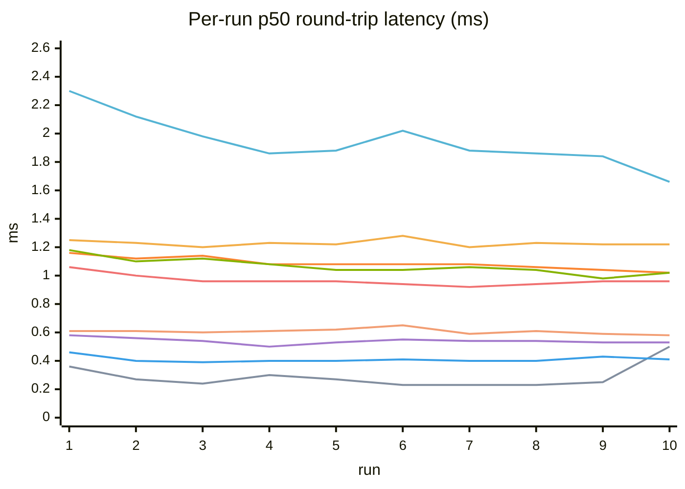
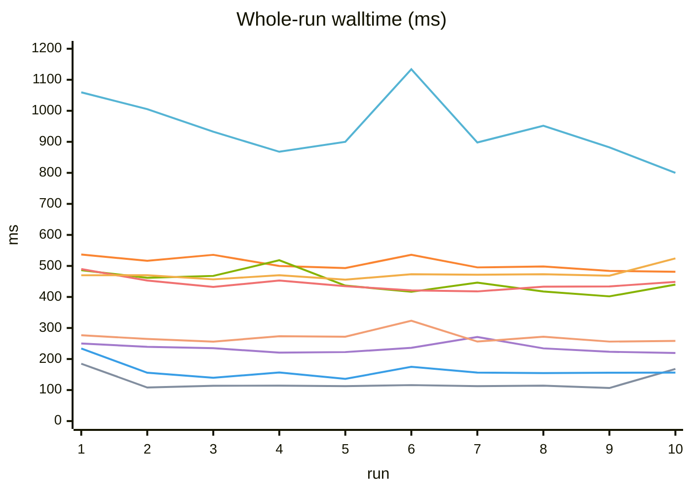
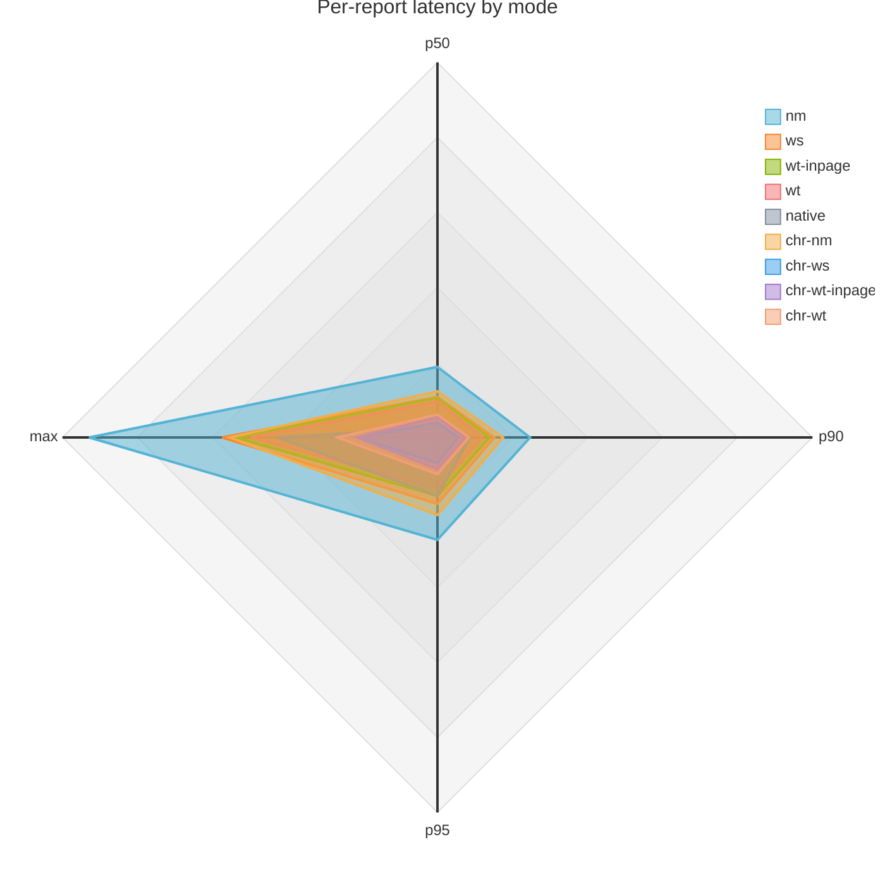
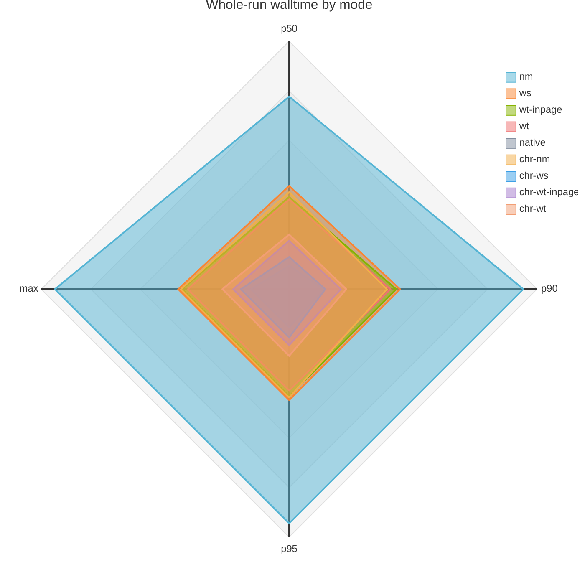

# FF-WebHID Benchmark Report

## Automated image-pipeline benchmark

A Playwright-driven end-to-end benchmark measuring the full data-plane
round-trip automatically across four modes: Firefox ws, Firefox nm, Chromium
native WebHID and Chromium native WebHID with the addon (same-engine
overhead measurement, `chromium-addon-benchmark` project).

**Scenario**: a benchmark page fetches a small PNG fixture
(`tests/fixtures/images/sample.png`, the project icon, ~32KB), chunks it into
62-byte
payloads behind a 2-byte sequence header (64-byte `sendReport(1, chunk)` per
chunk, the vendor report size), and sends every chunk with ack-wait. A
**streaming relay** injects every output report the `uhid-mock` echoes
straight back through the mock's `input` command, so input reports flow to
the page while it is still sending instead of arriving in one burst at the
end. The image decode
(`createImageBitmap`) runs inside the measured window, and incoming chunks
trigger **batched row-slice repaints** (a few
pixel rows per paint, so the image fills in progressively), keeping rendering
a real part of
the measured window instead of a single ~6ms final decode. That makes CPU
contention between the data plane and page rendering (the ws-vs-nm gap)
visible in the numbers: if WS receive/parse on a dedicated
worker really stays off the main thread, the render-heavy load should not
slow ws as much as nm. The measured window is
`performance.measure('roundtrip', 'send-start', 'image-painted')`,
5 runs per mode, printed with open (device open call duration),
warm-up (total wall time from warm-up start until a retry succeeds, so
failed attempts are included) and total (device open through run #1's
send-start) durations. Then a per-run table where each run's ~520 reports
are summarized as min/p50/p90/p95/max of per-report round-trip latency
(send to the report arriving back) plus the run's walltime (whole-run
roundtrip), followed by a min/p50/p90/p95/max summary of the whole-run
round-trip durations.

**What the numbers mean**: the round-trip includes an artificial relay hop
(mock stdout → test script → mock stdin), because a real HID device does not
echo output reports as input reports. The relay adds a roughly constant term
to every run, so it does not skew the ws-vs-nm comparison, but the absolute
values are not comparable to hardware latency. The measured window also
includes the page's own send phase (sendReport is ack-wait, so the burst is
serialized) and image decode/render, so it is an end-to-end pipeline number,
not a transport-only number.

**Run**:

```
npm run test:benchmark
```

Standalone project, `daemonMode: 'daemon-nm'`, Firefox only. The ws, wt and nm
modes are separate specs (`benchmark-ws.spec.ts` / `benchmark-wt.spec.ts` /
`benchmark-nm.spec.ts`),
each running in its own worker, so each gets an identical cold start (fresh
Firefox, profile, daemon, grant) with no mid-session toggle. The project
disables `privacy.reduceTimerPrecision` (the harness Firefox otherwise
quantizes `performance.now()` to 1ms), so per-report latency timestamps are
true floats. The data plane is selected by writing `settings :: dataPlane`
(global + site-scoped) to storage before the benchmark page loads, so the
bridge handshakes with the target mode from the start instead of racing a
mid-session `storage.onChanged` update.

A separate **Chromium project** (`chromium-benchmark`) benchmarks native
WebHID (no addon, no daemon; the mock talks straight to `/dev/hidraw`). It
runs fully automated and headless: `npm run test:benchmark:chromium`. WebHID
cannot be granted via CDP (`Browser.grantPermissions` rejects `hid`;
`DeviceAccess` does not cover the WebHID chooser), so the mock is pre-granted
with the `WebHidAllowDevicesForUrls` policy and the benchmark page's own
`open()` (`getDevices()`-based) finds it without ever touching
`requestDevice`/the chooser. The policy matches origins including the port, so
the benchmark serves on the fixed port 8123 and the policy file must contain
exactly `http://localhost:8123` (see the spec header for the JSON and the
install path). Chromium coarsens
`performance.now()` to 100us with no flag to disable that clamp, so the
benchmark page is served cross-origin-isolated (COOP/COEP, `tests/serve.ts`)
to get 5us timestamps instead.

The **addon Chromium project** (`chromium-addon-benchmark`,
`npm run test:benchmark:chromium:addon`) runs the same page on the same
Chromium build with the addon loaded unpacked (`TARGET=chromium` build,
`--disable-features=WebHID` removes native `navigator.hid`). All four data
planes run (nm, ws, wt, wt-inpage). The page has no CSP, so ws/wt spawn
their worker via the blob path; run this project on its own (the config pins
`workers: 1`), an early wt execution alongside other benchmarks showed
~4.7ms p50 while sequential runs are stable at ~0.6ms. Init `total` is
measured from the device `open` mark (run #1 send-start minus open-start)
for every series, so the modal-picker pairing that precedes open in the
addon flow is excluded and totals stay comparable across modes; per-report
and whole-run numbers are measured identically for every mode. Harness
conventions live in
`tests/helpers/chromium-addon.ts` and AGENTS.md.

All modes run
one unmeasured warm-up (no painting; the page shows "Warming up..."), an
awaited 96-report priming burst so run #1 starts with a clear path,
then the measured runs (the
count is the `BENCHMARK_RUNS` env var, falling back to the project's
`benchmarkRuns` use option, default 5) with run-level retries (a dropped or
late report invalidates the run, it does not produce a bogus number). The
summary row reports min/p50/p90/p95/max (nearest-rank percentiles; with the
default 5 runs p90 and p95 collapse onto max).

## Input-report loss benchmark (8000Hz, render-saturated page)

The plain image-pipeline benchmark never drops reports (idle pages do not
exercise the loss path), so a dedicated suite (`tests/benchmark/loss/`,
project `firefox-benchmark-loss`, `npm run test:benchmark:loss`) measures
delivery loss at 8000Hz: 6000 reports per run
(`BENCHMARK_LOSS_RATE` / `BENCHMARK_LOSS_COUNT` overridable), across all four
data-plane variants (nm, ws, wt, wt-inpage), on a page whose main thread is
busy with a fixed per-frame compute + canvas load. Each run prints
received/lost/loss%/gaps/maxGap/firstGap. The rate-gated WS batching
(12 reports per 4ms window widens the coalesce to 8ms) exists because of this
measurement: before it, render-load loss ran 1.6-4.3% at 8000Hz; after, the
worst run is ~0.6%. See AGENTS.md for the design record.

---

## Automated benchmark results (10 runs per mode)

Fresh page per spec (a new tab is created and closed around each spec, so no
mode measures on a page carrying JIT/GC/canvas state from earlier ones; the
harness's default tab stays untouched). `BENCHMARK_RUNS=10`, all four Firefox
modes in one worker. Each mode opens the mock device cold, runs one warm-up
burst, then 10 measured runs; a dropped or late report invalidates a run and
it is retried. The `chr-*` series adds the same-engine addon-vs-native
comparison on the same Chromium build; all four data planes run, see the
dataset tables.

Init time per mode, stacked:

```mermaid
---
config:
  themeVariables:
    xyChart:
      plotColorPalette: '#ADAEB1, #fa8532, #55b4d4'
---
xychart
    title "Init time per mode (ms)"
    x-axis [nm, ws, wt-inpage, wt, native, chr-nm, chr-ws, chr-wt-inpage, chr-wt]
    y-axis "ms" 0 --> 400
    bar "total" [325.4, 137.6, 173.8, 165.3, 23.9, 160.5, 64.7, 103.7, 92.5]
    bar "warmup" [319.6, 133.5, 168.4, 159.4, 19.6, 150.3, 60.7, 99.4, 88.1]
    bar "open" [7.6, 8.5, 12.4, 9.4, 0.6, 7.3, 12.7, 16.4, 11.1]
```



Per-run round-trip latency (p50) and whole-run walltime, for all 10 runs of
each mode, are charted below. Per-run percentiles, whole-run aggregates, and
the delta vs the native baseline are in the collapsible dataset section at
the end.

### Per-run charts

p50 round-trip latency per run, all modes:



Whole-run walltime per run, all modes:



Line colors (both charts, in series order):


Per-report round-trip latency (ms):



Whole-run walltime (ms):



<details>
<summary>Dataset (init time, per-run min/p50/p90/p95/max latency + walltime, aggregates, delta vs native)</summary>

**Init time** (open/warmup/total, ms)

| mode          | open (ms) | warmup (ms) | total (ms) |
| ------------- | --------- | ----------- | ---------- |
| nm            | 7.6       | 312.0       | 325.4      |
| ws            | 8.5       | 125.0       | 137.6      |
| wt-inpage     | 12.4      | 156.0       | 173.8      |
| wt            | 9.4       | 150.0       | 165.3      |
| native        | 0.6       | 19.0        | 23.9       |
| chr-nm        | 7.3       | 143.0       | 160.5      |
| chr-ws        | 12.7      | 48.0        | 64.7       |
| chr-wt-inpage | 16.4      | 83.0        | 103.7      |
| chr-wt        | 11.1      | 77.0        | 92.5       |

**nm** (Firefox, daemon-nm deployment)

| run | min  | p50  | p90  | p95  | max   | walltime |
| --- | ---- | ---- | ---- | ---- | ----- | -------- |
| #1  | 1.50 | 2.30 | 2.78 | 2.96 | 15.72 | 1059.5   |
| #2  | 1.42 | 2.12 | 2.72 | 3.08 | 11.32 | 1005.4   |
| #3  | 1.06 | 1.98 | 2.48 | 2.74 | 9.38  | 932.5    |
| #4  | 1.22 | 1.86 | 2.28 | 2.58 | 6.86  | 868.0    |
| #5  | 1.26 | 1.88 | 2.40 | 2.60 | 9.20  | 900.1    |
| #6  | 1.16 | 2.02 | 3.76 | 4.38 | 15.56 | 1134.0   |
| #7  | 1.20 | 1.88 | 2.46 | 2.72 | 8.06  | 897.9    |
| #8  | 1.18 | 1.86 | 2.80 | 3.46 | 11.16 | 951.9    |
| #9  | 1.10 | 1.84 | 2.36 | 2.64 | 8.76  | 882.2    |
| #10 | 1.02 | 1.66 | 2.12 | 2.36 | 9.08  | 800.0    |

**ws** (Firefox, daemon-nm deployment)

| run | min  | p50  | p90  | p95  | max   | walltime |
| --- | ---- | ---- | ---- | ---- | ----- | -------- |
| #1  | 0.68 | 1.16 | 1.54 | 1.78 | 6.46  | 536.9    |
| #2  | 0.64 | 1.12 | 1.54 | 1.76 | 4.76  | 516.5    |
| #3  | 0.74 | 1.14 | 1.62 | 1.94 | 6.32  | 535.8    |
| #4  | 0.68 | 1.08 | 1.52 | 1.80 | 4.56  | 499.8    |
| #5  | 0.68 | 1.08 | 1.52 | 1.86 | 4.40  | 493.2    |
| #6  | 0.64 | 1.08 | 1.58 | 1.84 | 14.08 | 535.9    |
| #7  | 0.62 | 1.08 | 1.40 | 1.64 | 7.38  | 495.3    |
| #8  | 0.70 | 1.06 | 1.46 | 1.60 | 4.28  | 498.2    |
| #9  | 0.64 | 1.04 | 1.36 | 1.62 | 5.50  | 484.1    |
| #10 | 0.68 | 1.02 | 1.34 | 1.60 | 5.98  | 481.1    |

**wt-inpage** (Firefox, daemon-nm deployment, WebTransport in-page)

| run | min  | p50  | p90  | p95  | max  | walltime |
| --- | ---- | ---- | ---- | ---- | ---- | -------- |
| #1  | 0.64 | 1.18 | 1.48 | 1.64 | 6.52 | 486.2    |
| #2  | 0.70 | 1.10 | 1.40 | 1.52 | 4.52 | 461.8    |
| #3  | 0.74 | 1.12 | 1.48 | 1.80 | 4.46 | 467.9    |
| #4  | 0.68 | 1.08 | 2.18 | 2.82 | 6.50 | 518.3    |
| #5  | 0.68 | 1.04 | 1.40 | 1.60 | 5.04 | 436.6    |
| #6  | 0.66 | 1.04 | 1.36 | 1.50 | 4.82 | 416.7    |
| #7  | 0.70 | 1.06 | 1.38 | 1.64 | 5.46 | 446.3    |
| #8  | 0.54 | 1.04 | 1.26 | 1.40 | 5.56 | 417.8    |
| #9  | 0.60 | 0.98 | 1.24 | 1.38 | 5.30 | 402.0    |
| #10 | 0.60 | 1.02 | 1.26 | 1.36 | 6.44 | 440.0    |

**wt** (Firefox, daemon-nm deployment, WebTransport over QUIC)

| run | min  | p50  | p90  | p95  | max  | walltime |
| --- | ---- | ---- | ---- | ---- | ---- | -------- |
| #1  | 0.72 | 1.06 | 1.40 | 1.68 | 4.30 | 490.0    |
| #2  | 0.70 | 1.00 | 1.22 | 1.44 | 4.08 | 452.9    |
| #3  | 0.66 | 0.96 | 1.18 | 1.28 | 4.28 | 432.4    |
| #4  | 0.64 | 0.96 | 1.24 | 1.40 | 5.26 | 453.0    |
| #5  | 0.66 | 0.96 | 1.24 | 1.40 | 6.22 | 434.7    |
| #6  | 0.60 | 0.94 | 1.18 | 1.30 | 4.24 | 421.3    |
| #7  | 0.58 | 0.92 | 1.16 | 1.28 | 4.68 | 417.9    |
| #8  | 0.64 | 0.94 | 1.18 | 1.32 | 5.54 | 433.3    |
| #9  | 0.60 | 0.96 | 1.18 | 1.32 | 6.32 | 434.0    |
| #10 | 0.58 | 0.96 | 1.24 | 1.40 | 6.28 | 448.5    |

**native** (Chromium, no addon, policy grant)

| run | min  | p50  | p90  | p95  | max  | walltime |
| --- | ---- | ---- | ---- | ---- | ---- | -------- |
| #1  | 0.09 | 0.36 | 2.32 | 2.93 | 7.73 | 184.9    |
| #2  | 0.09 | 0.27 | 0.83 | 1.52 | 4.33 | 108.2    |
| #3  | 0.09 | 0.24 | 0.89 | 1.43 | 4.39 | 113.9    |
| #4  | 0.09 | 0.30 | 1.12 | 1.87 | 4.54 | 114.1    |
| #5  | 0.09 | 0.27 | 0.80 | 1.93 | 3.45 | 112.7    |
| #6  | 0.08 | 0.23 | 0.87 | 1.59 | 4.03 | 116.0    |
| #7  | 0.09 | 0.23 | 0.68 | 1.09 | 4.20 | 112.5    |
| #8  | 0.08 | 0.23 | 0.87 | 1.13 | 3.16 | 114.3    |
| #9  | 0.08 | 0.25 | 0.86 | 1.28 | 3.14 | 106.6    |
| #10 | 0.10 | 0.50 | 1.97 | 2.22 | 4.59 | 168.0    |

**chr-nm** (Chromium, addon over the NM data plane,
daemon-as-NM-host)

| run | min  | p50  | p90  | p95  | max   | walltime |
| --- | ---- | ---- | ---- | ---- | ----- | -------- |
| #1  | 0.68 | 1.25 | 1.70 | 1.95 | 3.20  | 469.9    |
| #2  | 0.74 | 1.23 | 1.70 | 2.15 | 5.64  | 470.2    |
| #3  | 0.70 | 1.20 | 1.63 | 1.96 | 6.02  | 456.8    |
| #4  | 0.79 | 1.23 | 1.74 | 2.14 | 5.97  | 470.1    |
| #5  | 0.77 | 1.22 | 1.69 | 2.00 | 4.18  | 455.7    |
| #6  | 0.72 | 1.28 | 1.75 | 2.08 | 2.90  | 473.2    |
| #7  | 0.76 | 1.20 | 1.77 | 2.04 | 6.20  | 471.8    |
| #8  | 0.71 | 1.23 | 1.78 | 2.11 | 4.50  | 473.2    |
| #9  | 0.70 | 1.22 | 1.80 | 2.05 | 5.43  | 468.6    |
| #10 | 0.76 | 1.22 | 1.86 | 2.37 | 10.52 | 524.2    |

**chr-ws** (Chromium, addon, ws data plane with a blob-spawned
worker)

| run | min  | p50  | p90  | p95  | max  | walltime |
| --- | ---- | ---- | ---- | ---- | ---- | -------- |
| #1  | 0.22 | 0.46 | 1.24 | 2.69 | 6.36 | 233.9    |
| #2  | 0.23 | 0.40 | 0.54 | 0.66 | 1.57 | 155.8    |
| #3  | 0.22 | 0.39 | 0.53 | 0.64 | 1.27 | 139.5    |
| #4  | 0.23 | 0.40 | 0.55 | 0.68 | 2.44 | 156.6    |
| #5  | 0.20 | 0.40 | 0.53 | 0.68 | 1.73 | 136.0    |
| #6  | 0.24 | 0.41 | 0.71 | 1.02 | 3.11 | 175.0    |
| #7  | 0.23 | 0.40 | 0.57 | 0.76 | 1.49 | 156.4    |
| #8  | 0.23 | 0.40 | 0.55 | 0.70 | 1.50 | 154.8    |
| #9  | 0.22 | 0.43 | 0.57 | 0.65 | 5.96 | 155.8    |
| #10 | 0.22 | 0.41 | 0.56 | 0.71 | 2.82 | 156.2    |

**chr-wt-inpage** (Chromium, addon, wt data plane in the page,
`useWorker: false`)

| run | min  | p50  | p90  | p95  | max  | walltime |
| --- | ---- | ---- | ---- | ---- | ---- | -------- |
| #1  | 0.29 | 0.58 | 0.78 | 0.91 | 3.21 | 250.0    |
| #2  | 0.30 | 0.56 | 0.77 | 0.93 | 1.61 | 239.2    |
| #3  | 0.25 | 0.54 | 0.73 | 0.82 | 1.50 | 235.0    |
| #4  | 0.24 | 0.50 | 0.69 | 0.78 | 2.41 | 220.5    |
| #5  | 0.27 | 0.53 | 0.72 | 0.84 | 2.86 | 222.4    |
| #6  | 0.29 | 0.55 | 0.71 | 0.86 | 2.31 | 236.1    |
| #7  | 0.25 | 0.54 | 1.11 | 1.47 | 4.61 | 270.9    |
| #8  | 0.27 | 0.54 | 0.71 | 0.79 | 1.77 | 234.3    |
| #9  | 0.23 | 0.53 | 0.73 | 0.84 | 1.84 | 223.4    |
| #10 | 0.27 | 0.53 | 0.73 | 0.84 | 1.99 | 219.3    |

**chr-wt** (Chromium, addon, wt data plane with a blob-spawned
worker)

| run | min  | p50  | p90  | p95  | max  | walltime |
| --- | ---- | ---- | ---- | ---- | ---- | -------- |
| #1  | 0.28 | 0.61 | 0.81 | 0.95 | 3.79 | 276.5    |
| #2  | 0.36 | 0.61 | 0.85 | 0.94 | 2.41 | 264.8    |
| #3  | 0.27 | 0.60 | 0.80 | 0.97 | 2.13 | 256.0    |
| #4  | 0.30 | 0.61 | 0.84 | 1.03 | 2.70 | 273.4    |
| #5  | 0.33 | 0.62 | 0.86 | 0.98 | 4.50 | 271.9    |
| #6  | 0.35 | 0.65 | 1.30 | 1.69 | 4.20 | 323.4    |
| #7  | 0.31 | 0.59 | 0.84 | 1.02 | 2.27 | 256.3    |
| #8  | 0.32 | 0.61 | 0.85 | 0.98 | 4.55 | 271.8    |
| #9  | 0.26 | 0.59 | 0.81 | 0.91 | 2.14 | 256.2    |
| #10 | 0.30 | 0.58 | 0.84 | 0.98 | 2.63 | 258.5    |

**Whole-run walltime summary** (10 runs each)

| mode          | runs | min   | p50   | p90    | p95    | max    | total  |
| ------------- | ---- | ----- | ----- | ------ | ------ | ------ | ------ |
| nm            | 10   | 800.0 | 932.5 | 1134.0 | 1134.0 | 1134.0 | 9431.5 |
| ws            | 10   | 481.1 | 499.8 | 536.9  | 536.9  | 536.9  | 5076.8 |
| wt-inpage     | 10   | 402.0 | 446.3 | 518.3  | 518.3  | 518.3  | 4493.6 |
| wt            | 10   | 417.9 | 434.7 | 490.0  | 490.0  | 490.0  | 4418.0 |
| native        | 10   | 106.6 | 113.8 | 167.9  | 184.8  | 184.8  | 1251.2 |
| chr-nm        | 10   | 455.6 | 470.0 | 473.2  | 524.2  | 524.2  | 4733.7 |
| chr-ws        | 10   | 136.0 | 155.7 | 175.0  | 233.9  | 233.9  | 1620.0 |
| chr-wt-inpage | 10   | 219.2 | 234.2 | 249.9  | 270.9  | 270.9  | 2351.1 |
| chr-wt        | 10   | 255.9 | 264.7 | 276.5  | 323.3  | 323.3  | 2708.8 |

Summary stats are computed from the unrounded per-run walltimes while the
per-run tables round to one decimal, so a summary value can differ from the
rounded table by up to a rounding step; totals are exact sums.

</details>

**Delta vs the native baseline** (per-report p50 is the median of the 10
per-run p50 values; walltime p50 and total as in the summary table; total is
the sum of the 10 whole-run walltimes)

| mode          | per-report p50 | vs native    | walltime p50 | vs native     | total  | vs native      |
| ------------- | -------------- | ------------ | ------------ | ------------- | ------ | -------------- |
| native        | 0.26           | -            | 113.8        | -             | 1251.2 | -              |
| chr-ws        | 0.40           | +0.14 (1.5x) | 155.7        | +41.9 (1.4x)  | 1620.0 | +368.8 (1.3x)  |
| chr-wt-inpage | 0.54           | +0.28 (2.1x) | 234.2        | +120.4 (2.1x) | 2351.1 | +1099.9 (1.9x) |
| chr-wt        | 0.61           | +0.35 (2.3x) | 264.7        | +150.9 (2.3x) | 2708.8 | +1457.6 (2.2x) |
| wt (Firefox)  | 0.96           | +0.70 (3.7x) | 434.7        | +320.9 (3.8x) | 4418.0 | +3166.8 (3.5x) |
| wt-inpage     | 1.06           | +0.80 (4.1x) | 446.3        | +332.5 (3.9x) | 4493.6 | +3242.4 (3.6x) |
| ws (Firefox)  | 1.08           | +0.82 (4.2x) | 499.8        | +386.0 (4.4x) | 5076.8 | +3825.6 (4.1x) |
| chr-nm        | 1.23           | +0.97 (4.7x) | 470.0        | +356.2 (4.1x) | 4733.7 | +3482.5 (3.8x) |
| nm (Firefox)  | 1.88           | +1.62 (7.2x) | 932.5        | +818.7 (8.2x) | 9431.5 | +8180.3 (7.5x) |

## What the numbers mean

- **The addon is fastest over ws on Chromium**: per-report p50 0.40ms,
  1.5x native (0.26ms) and faster than every Firefox mode. wt (0.61ms) and
  wt-inpage (0.54ms) are 2.1-2.3x native; nm (1.23ms) is the slowest addon
  plane, and still beats Firefox nm (1.88ms) by 1.5x.
- **The addon adds little walltime**: chr-ws whole-run p50 is 155.7ms vs
  native 113.8ms (1.4x). On the same engine the addon is a 1.3-3.8x total
  overhead, tightest on ws (1.3x) and loosest on nm (3.8x). Firefox wt
  (434.7ms) still beats the slowest Chromium addon plane, chr-nm (470.0ms).
- **Init time** (open to run #1 send-start): native 23.9ms, addon planes
  65-161ms, Firefox 137-325ms. Warm-up is 19-312ms. The addon's modal-picker
  pairing precedes open, so it is not counted.
- **Not a polyfill-vs-native comparison for Firefox modes**: Firefox runs
  the polyfill over the daemon (daemon-nm deployment), Chromium native runs
  on the same mock; engine, transport and grant path differ. The same-engine
  comparison is the `chr-*` series on the same Chromium build as native.

### What the wt numbers buy (and cost)

- **wt beats ws on Firefox** (p50 0.96ms vs 1.08ms, walltime 434.7ms vs
  499.8ms) despite the TLS/QUIC handshake: WS input reports cross the
  content main thread (PWebSocket IPC into `RecvOnBinaryMessageAvailable`,
  then ChannelEventQueue into the worker), contending with page rendering;
  wt reads reports from a DataPipe shared-memory buffer on the worker with
  zero WebSocket IPC. Profiler-verified: ws main thread carries ~10.8k
  `OnBinaryMessageAvailable` + ~10.8k `FrameReceived` IPC markers per 3.5s
  spec and 3.8x the IPC of wt; main-thread CPU ws 75% vs wt 57%.
- **wt-inpage sits between**: no delivery hops, but the DataPipe read
  happens on the main thread.
- **Security**: loopback TLS does not stop a network MITM (there is no real
  network between daemon and browser); it stops another local process from
  impersonating the daemon at `127.0.0.1:<port>` without the private key
  (the `serverCertificateHashes` pin is unforgeable without it), and does
  not stop an attacker with admin/root. So WT is a free security option on
  loopback that is also the fastest Firefox data plane; the default
  `dataPlane` is wt (ws on Firefox < 114, where WebTransport does not
  exist).

---

## Profiling benchmark runs (Gecko profiler via RDP)

Each benchmark spec can capture a Gecko profile of the run around the
measured window, driven over the harness's existing Remote Debugging Protocol
connection (the same `-start-debugger-server` port the harness uses to drive
the extension background). No browser flags are needed; the capture connects
a second RDP client to the perf actor and starts/stops the profiler around
`runBenchmark`.

```
BENCHMARK_PROFILE_DIR=/tmp/profiles npm run test:benchmark
```

With `BENCHMARK_PROFILE_DIR` set, each spec writes
`<dir>/profile-<mode>[-inpage].json` (plain JSON, Firefox Profiler schema;
also `loss-<mode>.json` for the loss project) and prints a `[profiler] saved
...` line with the sampled thread list. The capture adds ~1-4s per spec
(server-side gzip of the profile).

Tunables (all optional):

| Env                          | Default                                      | Meaning                           |
| ---------------------------- | -------------------------------------------- | --------------------------------- |
| `BENCHMARK_PROFILE_FEATURES` | `js,stackwalk,ipcmessages,cpu,cpuallthreads` | Comma-separated profiler features |
| `BENCHMARK_PROFILE_THREADS`  | `GeckoMain,Worker`                           | Comma-separated thread filters    |
| `BENCHMARK_PROFILE_ENTRIES`  | `268435456`                                  | Per-process buffer size in bytes  |
| `BENCHMARK_PROFILE_INTERVAL` | `1`                                          | Sampling interval in ms           |

Notes:

- The profile nests child processes under the top-level `processes` array
  (Firefox Profiler schema); the top-level `threads` are the parent only.
  The benchmark page's content process is the one whose `GeckoMain` shows
  `benchmark-image.html` frames, and it carries the data worker as a
  `DOM Worker`.
- Native frames are unsymbolicated in the Playwright Firefox build (raw
  addresses); JS and WASM frames carry names, and `threadCPUDelta`
  (feature `cpu`/`cpuallthreads`) plus the `eventDelay` sample column give
  per-thread busy ratios and event-loop queueing without symbols.
- The profiler adds sampling overhead, so profiled runs are for mechanism
  analysis, not for mode comparison numbers.
- Finding (ws vs wt): the ws content-process main thread carries
  `Msg_OnBinaryMessageAvailable` / `Msg_FrameReceived` IPC markers
  (~10.8k each in a 3.5s spec) plus `ChannelEventQueue::Enqueue` markers,
  and 3.8x the main-thread IPC of wt; wt mode shows zero WebSocket IPC (the
  data arrives through a DataPipe shared-memory read on the worker). Measured
  main-thread CPU: ws 75% vs wt 57% in a full-suite run, matching the
  AGENTS.md delivery-gate mechanism.
