# Data Path Analysis

The path and cost tables describe the current implementation structure. They do not replace measured benchmark results; see [BENCHMARK.md](BENCHMARK.md) for run-specific measurements.

## 1. Execution Contexts

| #   | Context           | Process                         | Realm            | Files                                             |
| --- | ----------------- | ------------------------------- | ---------------- | ------------------------------------------------- |
| P   | Page MAIN world   | Firefox content (tab)           | Isolated (page)  | `content/main/index.js`                           |
| B   | Content script    | Firefox content (tab)           | Isolated (addon) | `content/isolated/bridge.js`                      |
| W   | Web Worker (data) | Firefox content (worker thread) | Worker           | `content/isolated/worker/index.js`                |
| G   | Background script | Firefox background              | Extension        | `background/index.js`                             |
| N   | NM host process   | OS process                      | --               | `webhid.forwarder_nm_host` or daemon NM-host mode |
| D   | Daemon process    | OS process                      | --               | `webhid-daemon`                                   |

Control ops (enumerate/open/close/handshake/setDataPlane) are NM-only, handled by bridge→background→NM host→daemon.

---

## 2. Cost Model

| Operation                                       | Copy cost                                        | Hop cost                               | Est. latency            |
| ----------------------------------------------- | ------------------------------------------------ | -------------------------------------- | ----------------------- |
| `postMessage` same-process (P↔B, B↔W)           | 1 structured clone (~5 to 15 µs for typed array) | 1 realm switch                         | 5 to 15 µs              |
| `postMessage` with transfer list                | 0 (buffer ownership moved)                       | 1 realm switch                         | 3 to 8 µs               |
| MessageChannel `port.postMessage` with transfer | 0 (buffer ownership moved)                       | 1 realm switch (direct W→P, no bridge) | 3 to 8 µs               |
| `runtime.sendMessage` (B↔G)                     | 1 clone + IPC marshal                            | 1 process boundary                     | 50 to 200 µs            |
| `connectNative.postMessage` (G→N)               | 1 JSON serialize + pipe write                    | 1 process spawn/pipe                   | 30 to 100 µs            |
| Unix socket write+read (N↔D, loopback)          | 2 kernel copies                                  | 1 process boundary                     | 5 to 15 µs              |
| WebSocket send+recv (W↔D, TCP loopback)         | 1 WS encode + 2 kernel copies                    | 1 process boundary                     | 10 to 30 µs             |
| `JSON.stringify`/`parse` (small obj)            | 1 alloc                                          | --                                     | 1 to 5 µs               |
| base64 encode/decode (64 B)                     | 1 alloc (+33% size)                              | --                                     | 0.5 to 2 µs             |
| Persistent per-device I/O worker queue          | 0 (command ownership moves into the queue)       | 1 blocking worker handoff              | not separately measured |
| `broadcast::send`/`recv` (tokio, Arc<[u8]>)     | 0 (Arc refcount bump)                            | 1 task wake                            | 1 to 3 µs               |
| hidraw `write(2)`/`read(2)` syscall             | 1 user→kernel (or reverse)                       | 1 kernel→driver                        | 5 to 30 µs              |
| `tabs.sendMessage` (G→B, tab-targeted)          | 1 clone + IPC                                    | 1 process boundary                     | 50 to 200 µs            |

---

## 3. Path Inventory

| Path | Message                      | Mode              | Sub-path                                                                                              |
| ---- | ---------------------------- | ----------------- | ----------------------------------------------------------------------------------------------------- |
| A    | `sendReport`                 | WS                | P→B→W→WS→D→hidraw→WS→W→B→P (ack-wait)                                                                 |
| C    | `sendReport`                 | NM                | P→B→G→NM→D→hidraw→NM→G→B→P (ack-wait)                                                                 |
| U    | `sendReport`                 | WT                | P→B→W→WT stream→D→hidraw→WT→W→B→P (ack-wait, same frame as WS)                                        |
| E    | `sendFeatureReport`          | WS                | Same as A (WS frame type 0x02)                                                                        |
| F    | `sendFeatureReport`          | NM                | Same as C (NM packed TLV 0x04)                                                                        |
| G    | `receiveFeatureReport`       | WS                | P→B→W→WS→D→hidraw→WS→W→B→P                                                                            |
| H    | `receiveFeatureReport`       | NM                | P→B→G→NM→D→hidraw→NM→G→B→P (JSON, action 5)                                                           |
| I    | Input report                 | WS + MessagePort  | hidraw→D→WS→W→MessagePort→P (direct, bypass bridge)                                                   |
| J    | Input report                 | WS, port fallback | hidraw→D→WS→W→postMessage→B→control port→P                                                            |
| K    | Input report                 | NM                | hidraw→D→NM→G→B→P (tab-targeted, or via data port)                                                    |
| W    | Input report                 | WT                | hidraw→D→WT→W→MessagePort→P (direct, bypass bridge)                                                   |
| L    | `enumerate`                  | NM                | P→B→G→NM→D→hidapi→NM→G→B→P                                                                            |
| M    | `open`                       | NM                | P→B→G→NM→D→hidapi→NM→G→B→P + persistent reader/I/O workers + data worker setup + MessagePort transfer |
| N    | `close`                      | NM                | P→B→G→NM→D→NM→G→B→P + reader/I/O worker teardown + data worker terminate + port return                |
| O    | `requestDevice`              | NM                | P→B (picker UI) → enumerate → user select → B pairs (bridge-side) → B→P                               |
| P    | `getDevices`                 | NM                | P→B→G→storage + enumeratePaired (or cache hit)                                                        |
| Q    | `handshake` (NM)             | NM                | B→G→NM→D→NM→G→B (returns wsPort + wsNonce)                                                            |
| R    | `connect`/`disconnect` event | NM                | D→NM→G→B→P (tab-targeted)                                                                             |
| S    | `getPolicy`                  | NM                | P→B→G (Permissions-Policy header cache + iframe `allow` attr check)                                   |
| T    | `globalReset`                | NM→G→B            | G broadcasts to all tabs on NM disconnect: B clears state, emits disconnect per device                |

All send/sendFeature paths are ack-wait (resolve on daemon response).

---

## 4. Detailed Path Analysis

### Path A - `sendReport` WS (ack-wait)

| Step      | Location                           | Operation                                                                                | Copies                         | Hops               |
| --------- | ---------------------------------- | ---------------------------------------------------------------------------------------- | ------------------------------ | ------------------ |
| 1         | `content/main/index.js`            | `view.slice()` own-buffer copy                                                           | 1                              | 0                  |
| 2         | `content/main/index.js`            | `dataPort.postMessage({type:'send',...}, [buffer])` → P→W via MessagePort                | 0 (transfer)                   | 1                  |
| 3         | `content/isolated/worker/index.js` | `frame = new Uint8Array(6+len); frame.set(payload,6)`                                    | 1 (alloc+copy)                 | 0                  |
| 4         | `content/isolated/worker/index.js` | `ws.send(frame)` → W→D                                                                   | 1 (WS encode) + 1 (kernel TCP) | 1                  |
| 5         | `batching.rs` / `device_mgr.rs`    | `payload[1..].to_vec()` then enqueue `IoCommand` on the persistent per-device I/O worker | 1 (payload copy)               | 1 (worker handoff) |
| 6         | `device_mgr.rs`                    | I/O worker calls `hid::write_report` using its thread-local write buffer                 | 1 (report-id + payload copy)   | 0                  |
| 7         | `hid.rs`                           | `dev.write(&buf)` → hidraw                                                               | 1 (kernel)                     | 1                  |
| 8         | `websocket.rs`                     | WS ack frame → D→W                                                                       | 1 (WS encode) + 1 (kernel)     | 1                  |
| 9         | `content/isolated/worker/index.js` | `handleControlResponse` → `dataPort.postMessage({type:'sendResult',...})` → W→P          | 0 (small obj)                  | 1                  |
| 10        | `content/main/index.js`            | `dataPort.onmessage` → resolve Promise                                                   | 0                              | 0                  |
| **Total** |                                    |                                                                                          | **8**                          | **6**              |

**Page-side latency**: **5 to 10 ms** (resolves on WS ack, not early).

**End-to-end latency**: **3 to 8 ms** (daemon-side write; ack returns after hidraw write completes).

---

### Path C - `sendReport` NM (ack-wait)

| Step      | Location                      | Operation                                                                                           | Copies                                    | Hops               |
| --------- | ----------------------------- | --------------------------------------------------------------------------------------------------- | ----------------------------------------- | ------------------ |
| 1         | `content/main/index.js`       | `view.slice()` own-buffer copy                                                                      | 1                                         | 0                  |
| 2         | `content/main/index.js`       | `bridgePort.postMessage` → P→B                                                                      | 1 (clone)                                 | 1                  |
| 3         | `content/isolated/bridge.js`  | `browser.runtime.sendMessage(msg)` → B→G                                                            | 1 (clone+IPC)                             | 1                  |
| 4         | `background/index.js`         | `buildPackedSend` → `port.postMessage({d:base64})` → G→N                                            | 1 (b64) + 1 (JSON)                        | 1                  |
| 5         | NM host                       | `read_frame` → `write_vectored` → socket → D                                                        | 2 (kernel)                                | 1                  |
| 6         | `client.rs` / `device_mgr.rs` | JSON parse + base64 decode + `data.to_vec()`, then enqueue `IoCommand` on the persistent I/O worker | 1 (JSON) + 1 (b64) + 1 (payload copy)     | 1 (worker handoff) |
| 7         | `device_mgr.rs`               | I/O worker calls `hid::write_report` using its thread-local write buffer                            | 1 (report-id + payload copy) + 1 (kernel) | 1                  |
| 8         | `client.rs`                   | NM response → N→G                                                                                   | 1 (JSON) + 2 (kernel)                     | 1                  |
| 9         | `background/index.js`         | sendResponse → G→B                                                                                  | 1 (clone+IPC)                             | 1                  |
| 10        | `content/isolated/bridge.js`  | `replyToPage` → B→P                                                                                 | 1 (clone)                                 | 1                  |
| 11        | `content/main/index.js`       | resolve Promise                                                                                     | 0                                         | 0                  |
| **Total** |                               |                                                                                                     | **16**                                    | **9**              |

**Page-side latency**: **8 to 20 ms** (full NM roundtrip).

**End-to-end latency**: **8 to 20 ms**.

---

### Path U - `sendReport` WT (ack-wait)

Identical to Path A with the transport leg swapped: the worker writes the same
`[0x01][reqId:u32 LE][reportId][payload]` frame over the persistent WT
bidirectional stream (each frame length-prefixed `[len:u32 LE]`; QUIC/TLS
encode + kernel UDP instead of WS encode + TCP). Same totals as Path A:
**8 copies, 6 hops**. Latency **3 to 8 ms** (benchmark per-report round-trip
p50 ≈ 0.85ms vs ws 0.78ms: QUIC/TLS loopback costs ~+0.07ms per report).

---

### Path I - Input report WS + MessagePort (rate-gated batching)

| Step                 | Location                           | Operation                                                                                                 | Copies                                     | Hops                  |
| -------------------- | ---------------------------------- | --------------------------------------------------------------------------------------------------------- | ------------------------------------------ | --------------------- |
| 1                    | `device_mgr.rs`                    | `dev.read_timeout` → `Arc::from(&buf[1..])`                                                               | 1 (kernel) + 0 (Arc)                       | 1                     |
| 2                    | `device_mgr.rs`                    | `tx.send(IpcResponse::InputReport{data: Arc})` → broadcast                                                | 0 (Arc move)                               | 1                     |
| 3                    | `batching.rs`                      | `event_rx.recv()` → `batch.push((reportId, data))`                                                        | 0 (Arc clone)                              | 0                     |
| 4                    | `batching.rs`                      | `write_batch_frame` prepend reportId + extend data                                                        | 1 (alloc+N×copy)                           | 0                     |
| 5                    | `websocket.rs`                     | `ws_sender.send` → D→W                                                                                    | 1 (WS encode) + 1 (kernel TCP)             | 1                     |
| 6                    | `content/isolated/worker/index.js` | `new Uint8Array(frame)` → parse batch → per-report `new ArrayBuffer(payloadLen)` + copy                   | 1 (kernel→JS) + 1 (alloc+copy per report)  | 0                     |
| 7                    | `content/isolated/worker/index.js` | `dataPort.postMessage({type:'inputReportBatch', reports}, transfers)` → W→P direct, one message per frame | 0 (transfers)                              | 1 (direct, no bridge) |
| 8                    | `content/main/index.js`            | `dataPort.onmessage` → `new DataView(d.data)` (zero-copy, no intermediate Uint8Array)                     | 0 (DataView wraps transferred ArrayBuffer) | 0                     |
| **Total (1 report)** |                                    |                                                                                                           | **6**                                      | **4**                 |

| Polling rate   | Est. latency | Added latency                |
| -------------- | ------------ | ---------------------------- |
| 1 kHz (sparse) | 1 to 5 ms    | 0 µs (immediate flush)       |
| 8 kHz (burst)  | 1 to 13 ms   | ≤8 ms (high-rate coalescing) |

**MessagePort direct delivery** eliminates the bridge re-forward (one fewer hop, one fewer structured clone, and no Xray unwrap allocation). Polyfill zero-copy DataView eliminates one ArrayBuffer and one byte copy per report. The worker's persistent HID I/O queue also handles output and feature operations without per-request thread-pool dispatch.

---

### Path W - Input report WT (rate-gated batching)

Same shape as Path I with the transport leg swapped: `batching.rs` runs the
same `batching::run_sender` and `write_batch_frame`; the frame crosses as a
length-prefixed message on the persistent WT stream (QUIC/TLS encode + kernel
UDP instead of WS encode + TCP).

| Step                 | Location                           | Operation                                                                          | Copies                                     | Hops                  |
| -------------------- | ---------------------------------- | ---------------------------------------------------------------------------------- | ------------------------------------------ | --------------------- |
| 1                    | `device_mgr.rs`                    | `dev.read_timeout` → `Arc::from(&buf[1..])`                                        | 1 (kernel) + 0 (Arc)                       | 1                     |
| 2                    | `device_mgr.rs`                    | `tx.send(IpcResponse::InputReport{data: Arc})` → broadcast                         | 0 (Arc move)                               | 1                     |
| 3                    | `batching.rs`                      | `event_rx.recv()` → `batch.push((reportId, data))`                                 | 0 (Arc clone)                              | 0                     |
| 4                    | `batching.rs`                      | `write_batch_frame` prepend reportId + extend data                                 | 1 (alloc+N×copy)                           | 0                     |
| 5                    | `webtransport.rs`                  | `frame_tx.send` → D→W over WT stream                                               | 1 (QUIC/TLS encode) + 1 (kernel UDP)       | 1                     |
| 6                    | `content/isolated/worker/index.js` | parse batch → per-report `new ArrayBuffer(payloadLen)` + copy                      | 1 (kernel→JS) + 1 (alloc+copy per report)  | 0                     |
| 7                    | `content/isolated/worker/index.js` | `dataPort.postMessage({type:'inputReportBatch', reports}, transfers)` → W→P direct | 0 (transfers)                              | 1 (direct, no bridge) |
| 8                    | `content/main/index.js`            | `dataPort.onmessage` → `new DataView(d.data)` (zero-copy)                          | 0 (DataView wraps transferred ArrayBuffer) | 0                     |
| **Total (1 report)** |                                    |                                                                                    | **6**                                      | **4**                 |

Latency: **1 to 5 ms** (same as Path I; +~0.07ms per report QUIC/TLS loopback cost, benchmark-measured).

---

---

### Path K - Input report NM

| Step      | Location                     | Operation                                           | Copies                             | Hops  |
| --------- | ---------------------------- | --------------------------------------------------- | ---------------------------------- | ----- |
| 1 to 2    | daemon                       | Same as I steps 1 to 2                              | 1 (kernel) + 0 (Arc)               | 2     |
| 3         | `client.rs`                  | `ipc_event_to_nm` → `data.to_vec()`                 | 1 (clone)                          | 0     |
| 4         | `client.rs`                  | `write_message` → JSON + base64                     | 1 (JSON) + 1 (b64)                 | 0     |
| 5 to 6    | NM host + Firefox NM         | socket → stdout → JSON parse → clone → G            | 2 (kernel) + 1 (parse) + 1 (clone) | 2     |
| 7         | `background/index.js`        | `tabs.sendMessage` → G→B                            | 1 (clone+IPC)                      | 1     |
| 8         | `content/isolated/bridge.js` | `replyToPage` or data port → B→P                    | 1 (clone)                          | 1     |
| 9         | `content/main/index.js`      | `new DataView(detail.data.buffer, ...)` (zero-copy) | 0 (DataView wraps existing buffer) | 0     |
| **Total** |                              |                                                     | **10**                             | **7** |

**Latency**: **8 to 18 ms**.

---

### Path L - `enumerate` (NM)

| Step      | Location                     | Operation                                              | Copies                             | Hops       |
| --------- | ---------------------------- | ------------------------------------------------------ | ---------------------------------- | ---------- |
| 1         | `content/main/index.js`      | `sendRequest("enumerate")` → P→B                       | 1 (clone, small obj)               | 1          |
| 2         | `content/isolated/bridge.js` | `browser.runtime.sendMessage` → B→G                    | 1 (clone+IPC)                      | 1          |
| 3         | `background/index.js`        | `port.postMessage({a:1})` → G→N                        | 1 (JSON)                           | 1          |
| 4         | NM host                      | `write_vectored` → socket → D                          | 2 (kernel)                         | 1          |
| 5         | `client.rs`                  | `read_message` → JSON parse → `device_mgr.enumerate()` | 1 (parse)                          | 1 (hidapi) |
| 6         | `client.rs`                  | `write_message` → JSON + devices                       | 1 (JSON) + 1 (kernel)              | 1          |
| 7 to 8    | NM host + Firefox NM         | socket → stdout → JSON parse → clone → G               | 2 (kernel) + 1 (parse) + 1 (clone) | 2          |
| 9         | `background/index.js`        | sendResponse → G→B                                     | 1 (clone+IPC)                      | 1          |
| 10        | `content/isolated/bridge.js` | `replyToPage` → B→P                                    | 1 (clone)                          | 1          |
| **Total** |                              |                                                        | **14**                             | **10**     |

**Latency**: **15 to 40 ms** (NM roundtrip + hidapi scan).

---

### Path M - `open` (always via NM)

| Phase                                                                                   | Copies | Hops   | Est. latency    |
| --------------------------------------------------------------------------------------- | ------ | ------ | --------------- |
| Request P→D (NM)                                                                        | 5      | 4      | 2 to 5 ms       |
| Daemon: hidapi open + reader thread + persistent per-device I/O worker                  | 0      | 1      | 5 to 15 ms      |
| Response D→P (NM, returns sessionToken + wsPort)                                        | 6      | 4      | 2 to 5 ms       |
| Data worker spawn (shadow URL or blob mode) + WS connect + MessagePort transfer (P→B→W) | 1      | 2      | 5 to 15 ms      |
| `setDataPlane` → daemon (NM)                                                            | 2      | 2      | 1 to 3 ms       |
| **Total**                                                                               | **14** | **13** | **15 to 45 ms** |

On `open()`, polyfill creates a `MessageChannel`, keeps port1 (`dataPort`), and transfers port2 to bridge via the control port. Bridge transfers port2 to the worker (`setPort` message). This establishes the direct W→P input-report channel.

---

### Path Q - `handshake` (NM, returns wsPort + wsNonce)

| Direction                                      | Copies | Hops  | Est. latency   |
| ---------------------------------------------- | ------ | ----- | -------------- |
| B→G→NM→D                                       | 3      | 3     | 2 to 5 ms      |
| D generates wsNonce (once per daemon instance) | 0      | 0     | <0.1 ms        |
| D→NM→G→B                                       | 4      | 3     | 2 to 5 ms      |
| **Total**                                      | **7**  | **6** | **5 to 10 ms** |

Bridge sends `handshake` on init. The response contains `wsPort` (the daemon's WS port) and `wsNonce` (per-daemon-instance nonce used to compute WS auth hashes). If wsNonce is absent, the WS data plane falls back to NM.

---

## 5. Summary Table - Latency per Message Type

| Message                         | WS (ack-wait)                                               | WT                          | NM (ack-wait)       |
| ------------------------------- | ----------------------------------------------------------- | --------------------------- | ------------------- |
| `sendReport` (page-side)        | **5 to 10 ms**                                              | **5 to 10 ms**              | **8 to 20 ms**      |
| `sendReport` (end-to-end)       | 3 to 8 ms                                                   | 3 to 8 ms                   | 8 to 20 ms          |
| `sendFeatureReport` (page-side) | **5 to 10 ms**                                              | **5 to 10 ms**              | **8 to 20 ms**      |
| `receiveFeatureReport`          | **6 to 12 ms**                                              | **6 to 12 ms**              | **15 to 30 ms**     |
| Input report (delivery)         | **1 to 5 ms** (MessagePort) / **2 to 6 ms** (port fallback) | **1 to 5 ms** (MessagePort) | **8 to 18 ms** (NM) |
| `enumerate` (NM)                | --                                                          | --                          | **15 to 40 ms**     |
| `close` (NM)                    | --                                                          | --                          | **10 to 20 ms**     |
| `open` (always NM)              | --                                                          | --                          | **15 to 45 ms**     |
| `handshake` (NM)                | --                                                          | --                          | **5 to 10 ms**      |
| `getDevices` (cache hit)        | **<0.1 ms**                                                 | **<0.1 ms**                 | **<0.1 ms**         |
| `getDevices` (cache miss)       | --                                                          | --                          | **15 to 40 ms**     |

---

## 6. Copy + Hop Summary

| Path                   | Copies | Hops | Bottleneck                                            |
| ---------------------- | ------ | ---- | ----------------------------------------------------- |
| A: sendReport WS       | 8      | 6    | Persistent I/O worker + TCP loopback + hidraw syscall |
| C: sendReport NM       | 16     | 9    | runtime.sendMessage + JSON/base64 + NM pipe           |
| I: Input MessagePort   | 6      | 4    | WS recv + per-report alloc                            |
| J: Input port fallback | 7      | 6    | Transfer eliminates 2 clones                          |
| K: Input NM            | 10     | 7    | JSON + base64 + tabs.sendMessage                      |
| U: sendReport WT       | 8      | 6    | Persistent I/O worker + QUIC/TLS + hidraw syscall     |
| W: Input WT            | 6      | 4    | QUIC/TLS encode + per-report alloc                    |
| L: enumerate (NM)      | 14     | 10   | hidapi scan                                           |
| M: open                | 14     | 13   | hidapi open + worker spawn + WS + setdataplane        |
| N: close (NM)          | 10     | 10   | NM roundtrip                                          |
| Q: handshake           | 7      | 6    | NM roundtrip (one-time, on init)                      |

---

## 7. Key Findings

1. **All sendReport/sendFeatureReport paths are ack-wait.** Polyfill resolves the Promise only on receipt of the daemon ack.

2. **MessagePort eliminates bridge re-forward for input reports.** Worker sends input reports directly to page via the transferred data port, bypassing bridge entirely. This eliminates 1 context hop, 1 structured clone, and 1 Xray unwrap allocation per report.

3. **Zero-copy polyfill eliminates GCMajor.** DataView created directly on transferred ArrayBuffer (no intermediate `new Uint8Array` copy) reduces allocation pressure by ~70%, preventing GCMajor from triggering during benchmarks.

4. **WS remains the fastest measured Firefox data plane on loopback**, while WT is the default because it avoids WebSocket IPC on the content main thread. WS sendReport is about 3 to 8ms end to end versus 8 to 20ms for NM, and input delivery is about 1 to 5ms versus 8 to 18ms for NM.

5. **Rate-gated batching** keeps latency low for sparse reports (0µs), coalesces bursts within 25µs, and widens to an 8ms window once the flush rate exceeds ~12 reports per 4ms, so 8kHz polling amortizes per-frame overhead without hurting low-rate latency.

6. **Daemon mode routing is session-scoped.** Each active session has its own device authority, owner client, mode, auth hash, cancellation signal, and transport generations. NM input forwarding uses a per-client hot binding, while WS and WT use revocable generation-scoped capabilities. A mode switch invalidates the previous binding before publishing the next one, so the daemon does not double-deliver or let stale transports reach the HID handle.

7. **WS data frame header is 6 bytes** (no device ID): `[type:u8][reqId:u32 LE][reportId:u8][payload]`. The WS connection is per-device, so the device ID is implicit. NM packed TLVs include a device ID (12-byte header) because the NM connection is shared across all devices.

8. **Control ops are NM-only.** enumerate/open/close/handshake always go via NM.

9. **WT is a worker data plane.** Path W mirrors Path I with the QUIC/TLS stream in place of the TCP/WS leg. Sends and input reports use the persistent WT transport, while the worker keeps parsing off the page's main thread.

---

## 8. Mermaid Sequence Diagrams

### Path A: `sendReport` WS (ack-wait)

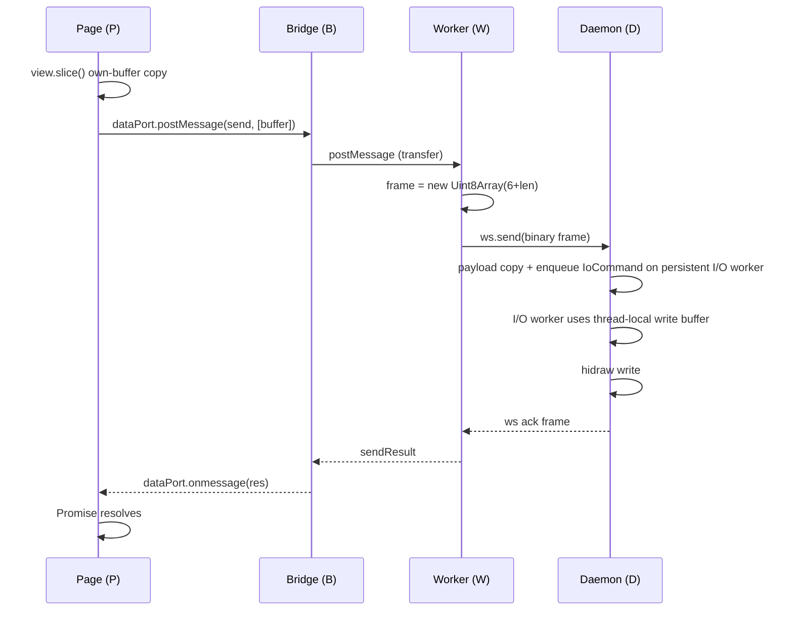

### Path C: `sendReport` NM (ack-wait)

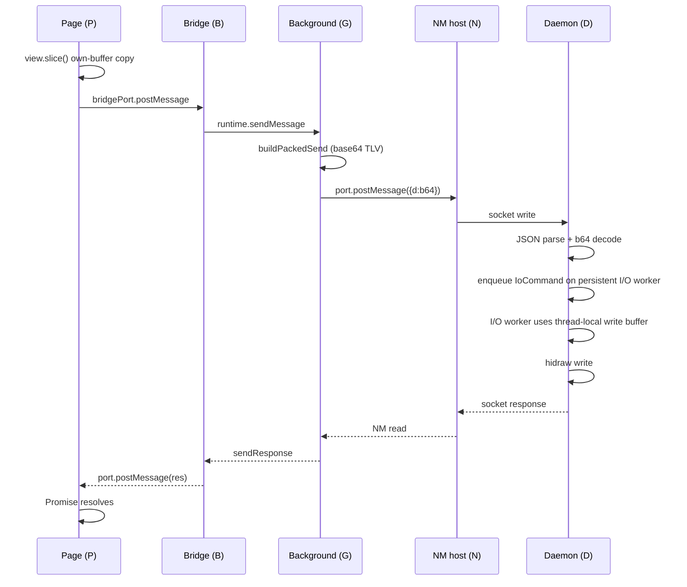

### Path I: Input report WS + MessagePort (rate-gated batching)

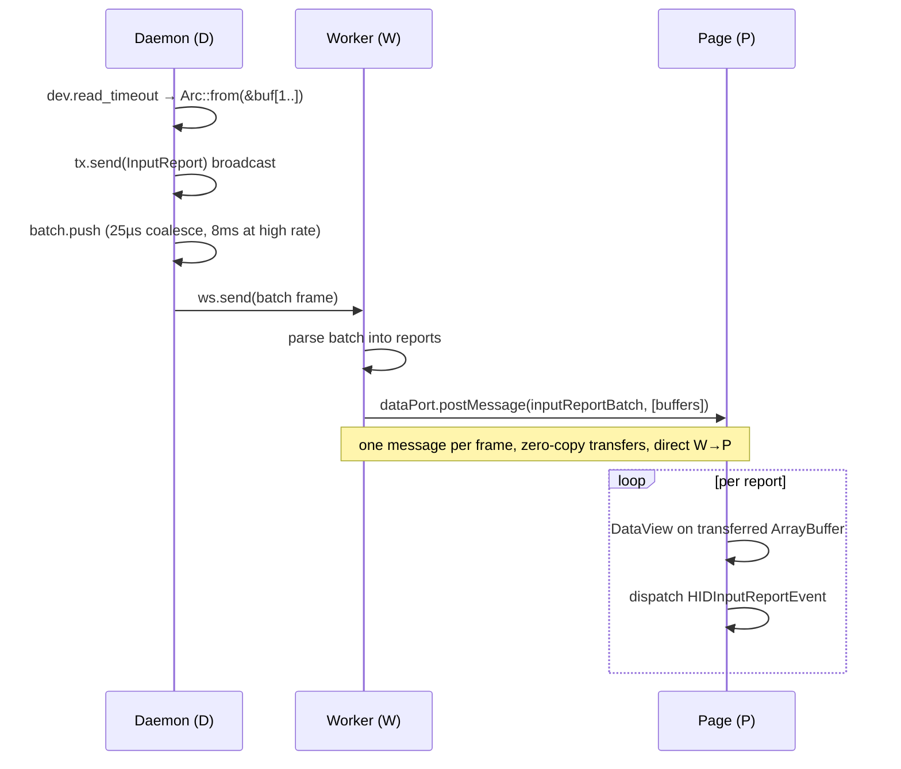

### Path W: Input report WT (rate-gated batching)

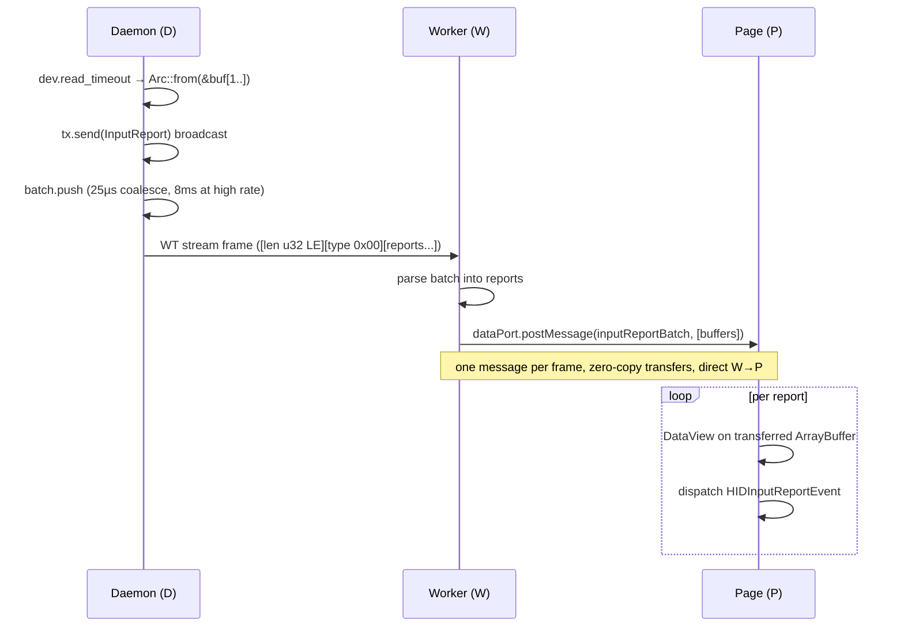

### Path J: Input report WS port fallback

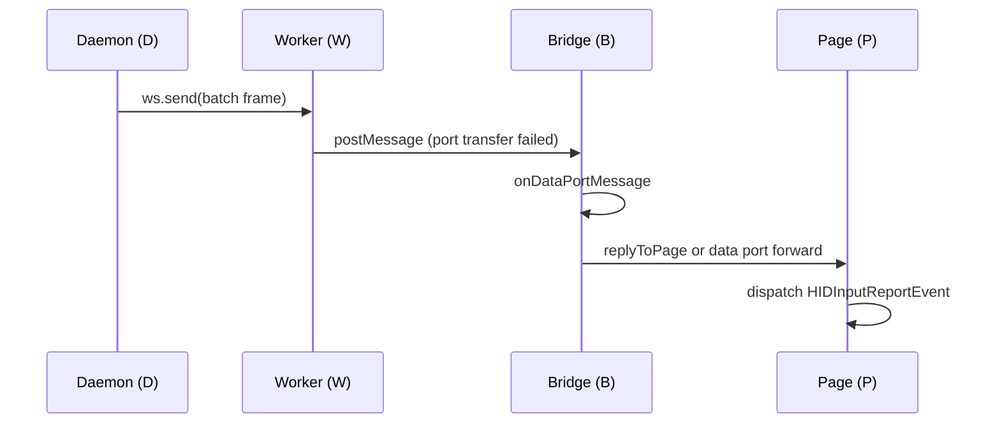

### Path K: Input report NM

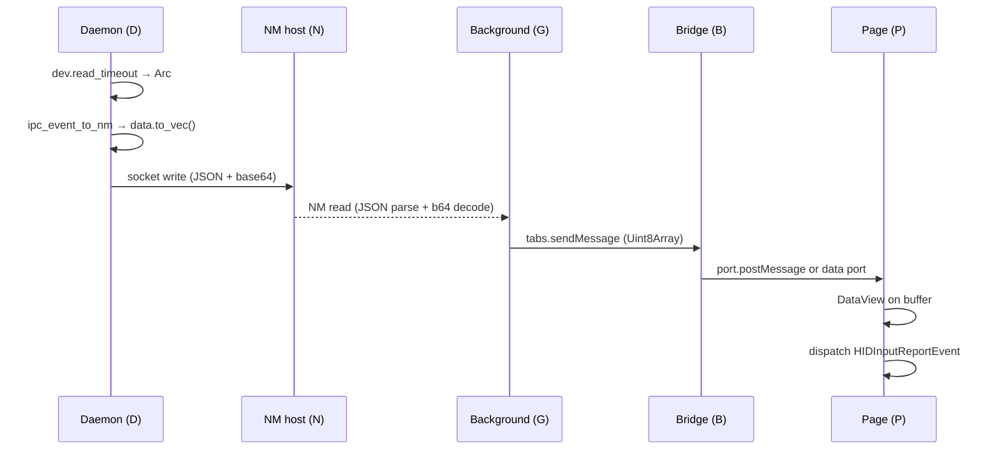

### Path L: `enumerate` (NM)

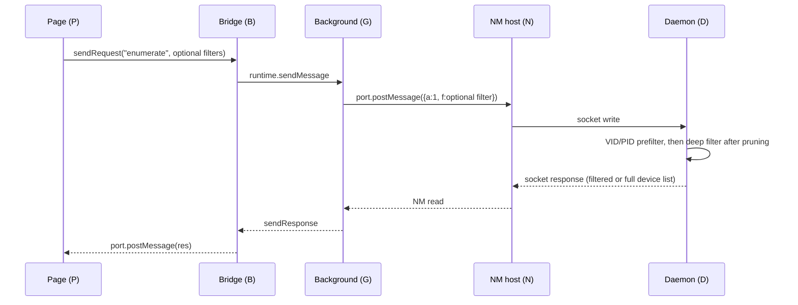

### Path M: `open` (NM + selected data-plane setup)

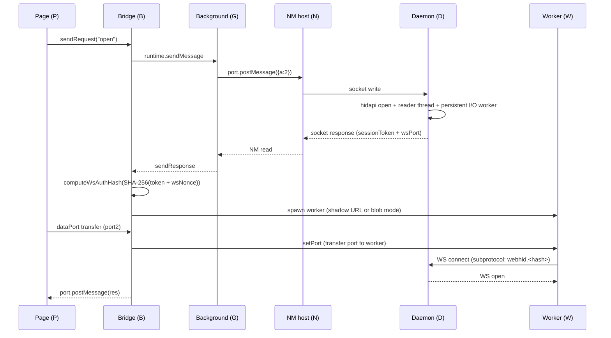

### Path N: `close` (NM + worker terminate)

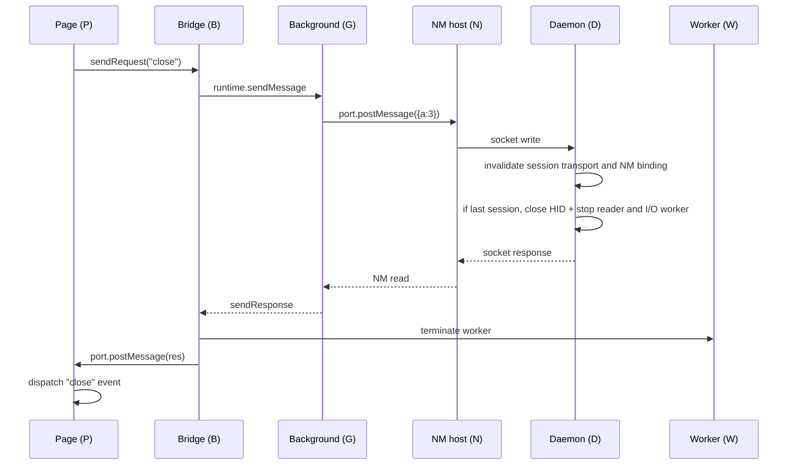

### Path O: `requestDevice` (picker UI + pairing)

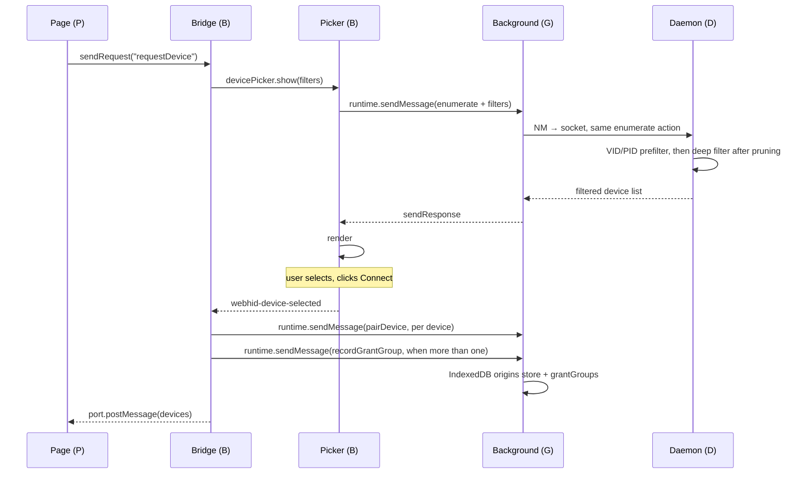

### Path Q: `handshake` (NM, one-time)

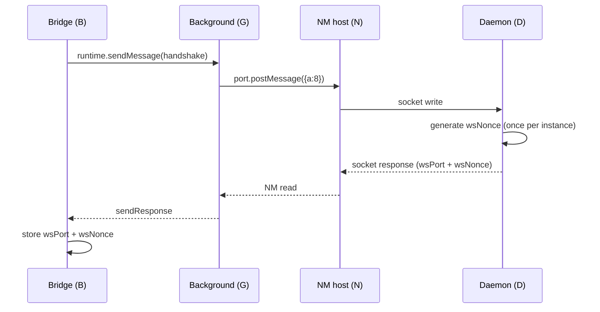

### Path R: `connect`/`disconnect` event (NM, tab-targeted)

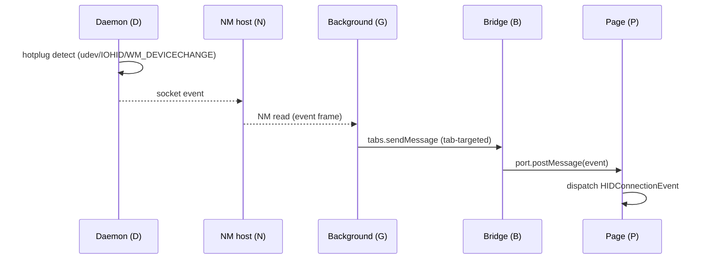

### Path S: `getPolicy` (Permissions-Policy check)

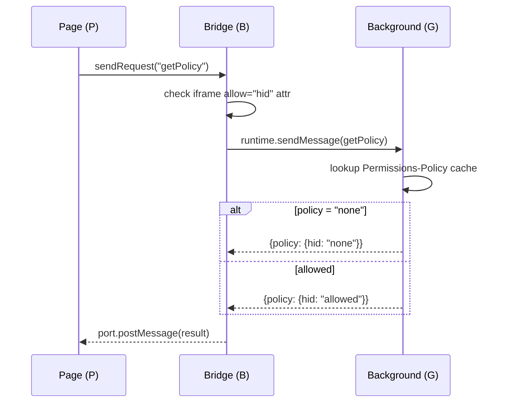

### Path T: `globalReset` (NM disconnect recovery)

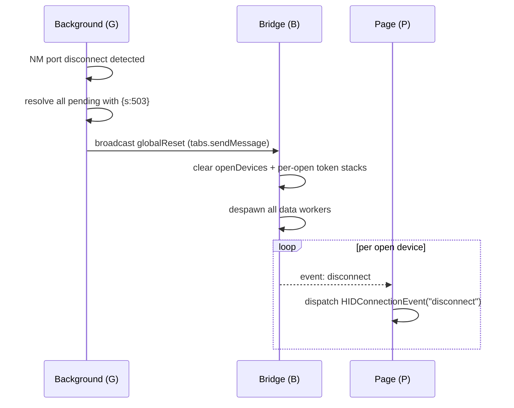
